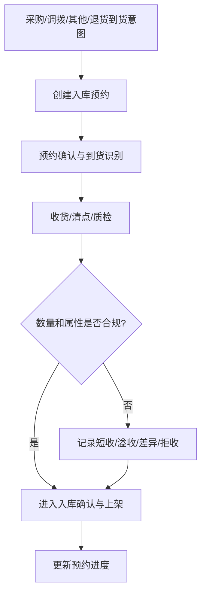
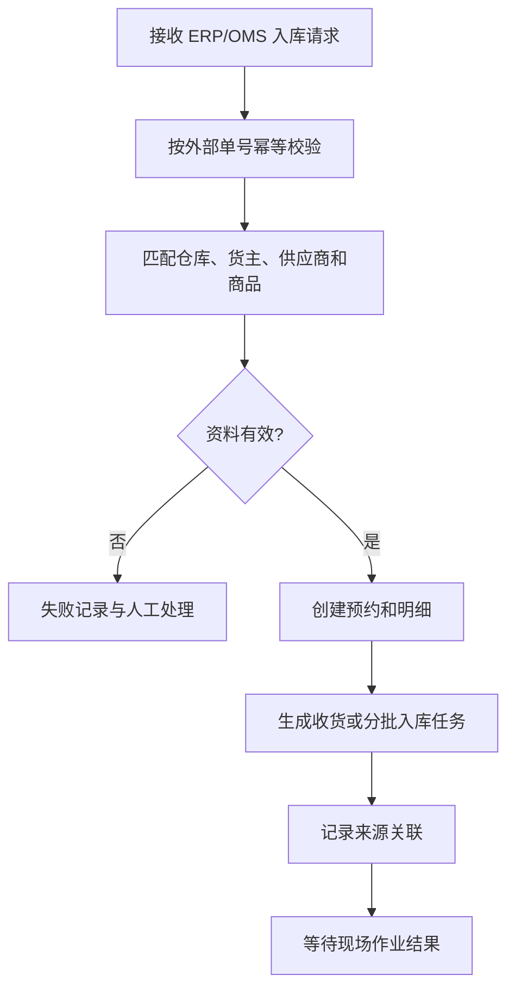
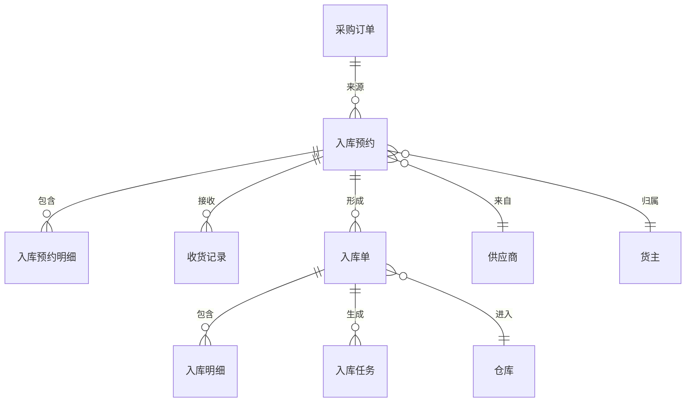

# 04 入库管理设计

## 1. 参考范围

参考 04 章“入库预约、其他入库单、采购入库单、销退入库单、销退预约、原单入库、收货入库、销退扫描入库”；补充参考 01 章库存初始化、02 章批次和序列号、03 章入库配置。

## 2. 模块目标与业务边界

解决外部到货、采购、调拨、其他入库和售后退回如何进入 WMS，并形成可执行的收货任务。

包含入库通知/预约、入库单、来源关联、收货数量、异常数量和入库前置校验。

不包含收货现场操作、质检、上架和库存最终生效的具体执行；这些由 05 模块承接。

## 3. 角色与业务场景

**参考事实**：ERP 推送采购计划后在 WMS 生成入库预约；入库预约包括采购、调拨、其他等类型；销退预约由 ERP 发起退货或换货请求生成；支持原单入库、快速入库和扫描入库。

**建议设计**：采购/业务系统创建入库通知，仓库主管确认预约，收货人员执行后续作业，系统管理员处理异常来源单。

### 场景说明

| 使用场景 | 触发时机与参与者 | 为什么要用入库管理 | WMS 解决的问题 | 结果 | 类型 |
|---|---|---|---|---|---|
| 采购到货 | 采购订单已下达，供应商即将送货 | 提前知道货物、数量和到货时间，安排收货资源 | 将外部采购意图转成可跟踪的入库预约 | 到货可排队、可核对、可追溯 | 参考事实＋归纳判断 |
| 仓间调拨到货 | 另一仓库发出调拨货物 | 入库端需要知道来源和应收数量 | 以调拨来源关联入库，避免把内部转移当采购 | 形成跨仓收发闭环 | 参考事实＋建议设计 |
| 其他入库 | 赠品、初始化、样品或非采购货物进入仓库 | 没有标准采购单，但仍需纳入库存账 | 用其他入库类型承接非标准来源 | 库存来源和责任人可追溯 | 参考事实＋建议设计 |
| 销售退货/换货 | 客户退回或换货请求到达 | 退回商品不能直接混入可售库存 | 关联原订单，进入收货、质检和入库判断 | 可区分可售、残次或待处理库存 | 参考事实＋归纳判断 |
| 无预约到货 | 现场先到货，外部单据尚未同步 | 强行拒收会影响现场，但直接入账风险高 | 允许进入待匹配/疑难件队列，不默认为正常入库 | 先隔离识别，再决定是否入账 | 建议设计＋待确认 |

## 4. 业务流程图

## 5. 系统流程图

## 6. 实体对象与单据

## 7. 单据状态与操作矩阵

入库预约的“在途、部分收货、收货完成、关闭”是参考事实；入库任务状态和部分统一状态是根据章节行为形成的建议设计。

| 单据/任务 | 状态 | 状态进入条件 | 可执行操作 | 结果 |
|---|---|---|---|---|
| 入库预约 | 在途 | 预约已建立、尚未实际入库 | 查询、收货、修改允许字段 | 生成收货记录或入库单 |
| 入库预约 | 部分收货 | 已收货数量小于计划数量 | 继续收货、查看差异 | 保留未收数量 |
| 入库预约 | 收货完成 | 计划数量已完成 | 查询、后续处理 | 不再继续正常收货 |
| 入库预约 | 关闭 | 外部通知关闭或业务关闭 | 查询、查看原因 | 是否允许继续入库待确认 |
| 入库任务 | 作业中 | 清点或质检生成任务 | 确认入库、取消入库 | 生成生效入库单或取消结果 |
| 入库任务 | 已完成/已取消 | 操作成功或取消成功 | 只读 | 回写来源单据和流水 |

### 单据、任务与数量关系

这里要把“来源单据”“现场记录”和“生效单据”分开。尤其是采购订单不会直接生成序列号；序列号是入库明细或库存身份记录，实际数量和序列号个数取决于现场收货及商品管理方式。

| 上游对象 | 下游对象 | 可能关系 | 关系说明 | 类型 |
|---|---|---:|---|---|
| 采购订单 | 入库预约 | 1:N | 一个 PO 可能按仓库、到货批次或供应商分批形成多个入库预约；手册未给出统一拆分规则 | 归纳判断＋待确认 |
| 入库预约 | 入库预约明细 | 1:N | 一张预约包含多个 SKU 行，每行有计划数量和来源信息 | 参考事实 |
| 入库预约 | 收货记录 | 1:N | 允许分批到货或多次收货，因此一次预约可有多条实收记录 | 参考事实＋建议设计 |
| 入库预约 | 入库单 | 1:N | 一次预约可能因分批、差异或不同库存属性形成多张生效入库单，具体拆分口径待确认 | 建议设计＋待确认 |
| 入库预约 | 清点/质检/入库任务 | 1:N | 任务按作业环节、批次、容器或分批结果拆分 | 参考事实＋归纳判断 |
| 入库单明细 | 序列号记录 | 1:N | 序列号管理商品通常按实际收货数量登记序列号；不是“一个 PO 固定生成几张 SN” | 参考事实＋建议设计 |
| 入库单 | 库存流水 | 1:N | 生效入库单按仓库、库位、批次、序列号等库存维度生成流水 | 建议设计 |

### 状态动作补充矩阵

| 单据/对象 | 当前状态/动作 | 操作前提 | 操作后的状态 | 是否生成任务、流水或关联单据 | 是否允许取消、撤销或反向处理 |
|---|---|---|---|---|---|
| 入库预约 | 创建/确认 | 来源、仓库、货主和商品校验通过 | 在途 | 可生成收货/清点/质检任务，不生成库存流水 | 生效前可取消；已开始收货需走关闭/差异处理 |
| 入库预约 | 部分收货 | 实收量小于计划量且结果已提交 | 部分收货 | 生成收货记录，库存是否生效由入库确认节点决定 | 可继续收货；已生效数量需通过反向单据处理 |
| 入库任务 | 确认入库 | 明细、批次、序列号、目标位置校验通过 | 已完成 | 生成入库单和库存流水，并回写预约进度 | 未生效可取消；已生效不直接撤销，需反向处理 |
| 入库任务 | 取消 | 任务未产生不可逆库存结果 | 已取消 | 生成取消日志，不生成入库库存流水 | 已取消不可恢复原任务，需新建补充任务 |

## 8. 库存影响

间接影响。入库预约和入库单创建本身不应增加库存；库存增加应发生在明确的“确认入库/入库生效”节点。参考资料明确存在 PDA 装箱后、PC 确认入库前库位库存不增加的场景。

建议在生效时生成入库库存流水，并按仓库、库位、SKU、库存属性、批次和序列号维度更新库存。

## 9. 异常与逆向流程

适用：

- 取消未生效入库任务：不生成入库单，关联清点/质检单转为取消或保留原记录，具体以任务模型确认。
- 短收、溢收、差异收货：必须记录计划量、实收量、差异量和处理决定。
- 预约关闭：禁止新收货还是允许完成已开始作业，资料未统一说明。
- 原单入库、销退入库需要避免重复关联同一出库订单。
- 未匹配预约的退货应进入疑难件流程，不得默认为正常入库。

## 10. 字段与业务逻辑

本节字段模型和校验组合属于建议设计；入库单号、外部单号、入库类型、仓库、货主、供应商、承运商和运单号是手册明确出现或可直接归纳的参考事实。

核心字段：入库单号、外部单号、入库类型、仓库、货主、供应商、承运商、运单号、预约时间、计划数量、已收数量、差异数量、状态、备注和来源单号。

行字段：SKU、商品条码、计划数量、实收数量、单位、批次、生产日期、过期日期、序列号、库存属性、目标库位和异常原因。

校验重点：外部单号幂等、货主和仓库匹配、商品编码映射、批次/序列号规则、超收开关、销退差异收货、预约单状态和重复收货。

### 表头字段

| 字段名称 | 字段含义 | 来源/写入时机 | 必填性 | 可修改时点 | 查询/展示/导出 | 校验与下游影响 | 类型 |
|---|---|---|---|---|---|---|---|
| 入库单号/预约单号 | WMS 内部单据身份 | 创建预约或生效入库单时生成 | 系统必填 | 不可改 | 全链路追溯 | 单号唯一，作为任务和流水关联键 | 参考事实＋建议设计 |
| 外部单号/来源类型 | ERP/OMS 来源与采购、调拨、其他、退货分类 | 外部请求或人工创建 | 对接场景必填 | 生效前可改；生效后只读 | 列表、同步日志 | 外部单号与来源系统组合幂等 | 参考事实＋建议设计 |
| 仓库/货主 | 入库归属范围 | 来源映射或用户选择 | 必填 | 生效前可改 | 单据、库存、权限 | 必须已授权且启用 | 参考事实＋建议设计 |
| 供应商/承运商/运单号 | 到货责任和运输识别 | 外部同步或收货录入 | 按场景必填 | 收货前可补充 | 收货、异常、报表 | 退货和采购的来源关系不同 | 参考事实＋建议设计 |
| 计划到货时间/实际收货时间 | 预约和现场时点 | 预约创建/收货提交 | 计划时点必填，实际由系统记录 | 实际时间不可手改 | 看板、绩效 | 统计口径需区分业务时间和记账时间 | 参考事实＋建议设计 |
| 单据状态 | 在途、部分收货、完成、关闭等 | 系统按业务动作更新 | 系统生成 | 只能通过动作改变 | 列表和详情 | 状态变化必须同步任务和来源进度 | 参考事实＋归纳判断 |

### 明细字段

| 字段名称 | 字段含义 | 来源/写入时机 | 必填性 | 可修改时点 | 查询/展示/导出 | 校验与下游影响 | 类型 |
|---|---|---|---|---|---|---|---|
| 商品/SKU | 计划收货商品 | 来源单或扫码匹配 | 必填 | 未收货前可改 | 单据、库存 | 必须是启用商品且归属正确货主 | 参考事实＋建议设计 |
| 计划数量/实收数量 | 应收与实际到货数量 | 来源单/收货作业 | 计划必填，实收由作业写入 | 实收提交后受限 | 进度、差异、报表 | 实收不能无依据超过允许超收范围 | 参考事实＋建议设计 |
| 单位/换算数量 | 收货计量单位及基本数量 | 商品条码或人工选择 | 必填 | 收货提交前可改 | 明细、库存 | 与商品单位换算一致 | 参考事实＋建议设计 |
| 批次/生产日期/过期日期 | 批次和效期身份 | 扫码或人工录入 | 按商品规则必填 | 生效后不可改 | 批次追溯、库存 | 唯一组合和日期先后需校验 | 参考事实＋建议设计 |
| 序列号明细 | 每个序列号身份 | 收货扫描或导入 | 序列号商品必填 | 生效后只读 | 序列号追溯 | 序列号数量应与实收数量一致，重复即阻止 | 参考事实＋建议设计 |
| 库存属性/目标库位 | 正常、残次、待处理及目标位置 | 质检/上架指导 | 按流程必填 | 生效前可调整 | 库存和任务 | 属性与库位存储条件匹配 | 参考事实＋建议设计 |
| 差异原因/处理决定 | 短收、溢收、拒收等处理 | 异常提交时 | 有差异必填 | 审核前可补充 | 异常报表 | 决定是否形成补单、隔离或关闭 | 建议设计＋待确认 |

## 11. 功能清单

| 优先级 | 功能 | 目标与上下游影响 |
|---|---|---|
| P0 | 入库预约和入库单 | 建立所有入库来源 |
| P0 | 采购/调拨/其他/销退类型 | 覆盖通用入库场景 |
| P0 | 收货进度和差异记录 | 支撑部分收货与异常 |
| P0 | 来源单关联和幂等 | 防止重复入库 |
| P1 | 扫码匹配、快速入库、原单入库 | 提升收货效率 |
| P1 | 入库审批和分批入库 | 支撑复杂仓库控制 |
| 后续 | 疑难件智能匹配和平台专属入库 | 后续扩展 |

### 功能说明与首版取舍

| 优先级 | 功能 | 使用场景 | 解决的问题 | 核心交互/规则 | 生成或影响对象 | 我们的补充说明 |
|---|---|---|---|---|---|---|
| P0 | 入库预约/通知 | 采购、调拨、退货即将到货 | 仓库不知道收什么、何时收、收谁的 | 创建来源、明细、计划时间和责任主体 | 入库预约、收货任务 | 是入库主链入口，不等同库存已增加 |
| P0 | 多类型入库 | 采购、调拨、其他、销退 | 不同来源的责任和差异规则混在一起 | 类型驱动来源校验和后续流程 | 入库单、来源关联 | 类型字典先收敛，平台专属类型后置 |
| P0 | 分批收货与进度 | 到货分批或预约未一次完成 | 不能区分已收与未收 | 累计实收，保留剩余量和差异量 | 预约、收货记录、任务 | “收货完成”必须有可计算口径 |
| P0 | 来源幂等与关联 | ERP 重复推送或退货重复入库 | 重复单据导致重复库存 | 外部单号+来源系统+货主等组成幂等键 | 接口日志、入库单 | 失败重试不能重复创建生效单据 |
| P1 | 快速/扫描/原单入库 | 已知来源且现场节奏快 | 手工查找单据耗时 | 扫码单号、商品或原出库单带出可收明细 | 收货记录、入库任务 | 快速路径仍需保留异常和追溯 |
| P1 | 差异与疑难件 | 无预约、短收、溢收、拒收 | 异常货物被误入正常库存 | 先记录、隔离、判定，再决定是否入账 | 异常记录、补单/反向单据 | 具体补单规则需要业务确认 |
| 后续 | 平台专属入库 | 特定渠道或平台售后 | 通用模型无法承接特殊字段 | 以扩展类型接入，不污染主流程 | 扩展单据、接口日志 | 不作为通用首版硬编码 |

## 12. 万里牛设计借鉴判断

### 判断标准

| 维度 | 判断问题 |
|---|---|
| 通用性 | 入库预约、分批收货和来源关联是否适用于采购、调拨、其他和退货？ |
| 业务价值 | 是否让仓库提前准备、准确收货并处理差异？ |
| 闭环完整性 | 是否覆盖来源、收货、任务、库存生效、异常和回写？ |
| 实现成本 | 首版是否能先实现主链，再扩展质检和疑难件？ |
| 边界风险 | 是否受 ERP 订单模型、退货政策和行业质检规则影响？ |

判断入库设计时，不能只看“有几种入库单”，还要看来源单、实收数量、任务和库存生效是否能闭环。

### 详细借鉴判断

| 参考设计表现 | 可复用原因 | 我们的改造 | 不能照搬的边界 | 结论/类型 |
|---|---|---|---|---|
| ERP 采购计划/订单先形成入库预约 | 仓库需要在到货前准备资源 | 统一采购、调拨、其他和退货来源模型 | 不固定某 ERP 的推送页面和字段 | 建议直接借鉴；参考事实＋归纳判断 |
| 预约有在途、部分收货、完成、关闭 | 能表达计划与实际进度差异 | 用数量守恒驱动状态，并保留关闭原因 | 关闭后是否允许继续收货不能默认为统一规则 | 建议直接借鉴并补充；参考事实＋建议设计 |
| 支持采购、调拨、其他、销退 | 来源不同，责任和异常规则不同 | 用统一入库主链承接不同来源 | 不把平台售后类型硬编码进核心单据 | 建议直接借鉴；参考事实＋建议设计 |
| 原单入库、快速入库、扫描入库并存 | 现场效率和来源完整性有不同要求 | 都回到收货—生效—回写主链 | 快速路径不能跳过身份和库存校验 | 建议改造后借鉴；参考事实＋建议设计 |
| 分批入库任务和取消结果 | 现场作业可能部分完成或撤销 | 增加异常、补单、反向处理和幂等 | 不从按钮名称推导完整冲销规则 | 建议改造后借鉴；参考事实＋待确认 |

| 判断 | 内容 |
|---|---|
| 建议直接借鉴 | 预约先于实际入库；采购/调拨/其他与销退场景分开；预约页面展示商品明细和操作记录 |
| 建议改造后借鉴 | 原单入库、扫描匹配、疑难件和分批入库任务统一到入库通知—收货—生效模型 |
| 不建议照搬 | “近 7 天”默认查询、快捷键和平台/ERP 专用识别方式 |
| 我们需要补充 | 统一入库类型字典、差异处理、拒收和反向入库单 |
| 资料不足，待确认 | 关闭预约后的继续收货规则、入库审批与库存生效的先后关系 |

## 13. 跨模块依赖与待确认问题

1. 入库预约类型是否统一为采购、调拨、其他、退货、换货五类，还是退货单独建模。
2. 采购订单、调拨出库和销退单的外部来源字段。
3. 质检不合格、短收、溢收和拒收是否都形成独立异常单。
4. 入库单确认后库存增加、上架后库存增加，还是收货即增加。
5. 入库单修改、审批撤销和已生效单据的反向处理规则。
