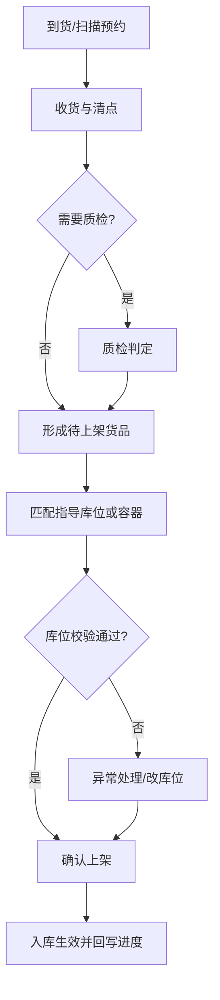
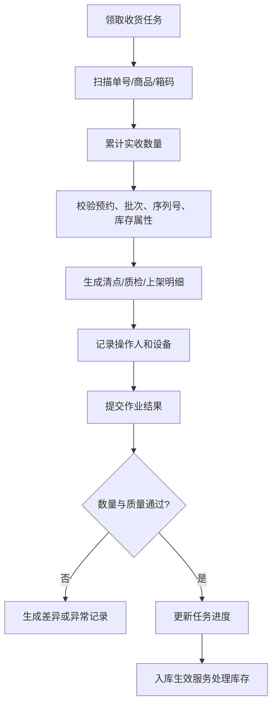
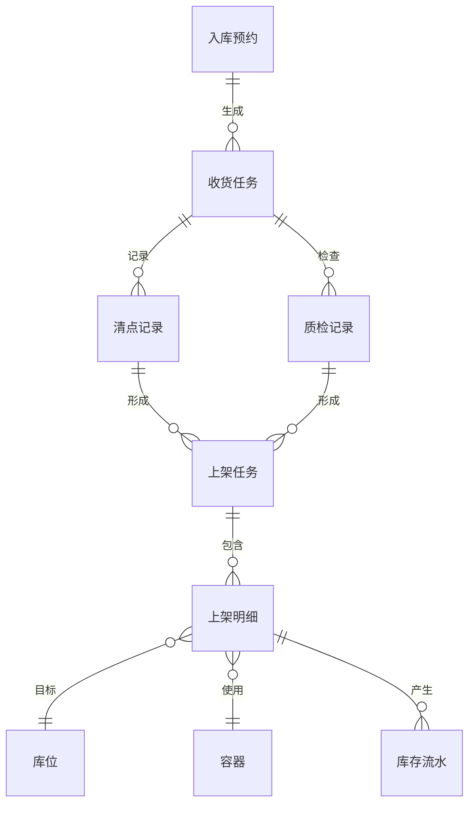

# 05 收货、质检与上架作业设计

## 1. 参考范围

参考 04 章“收货入库、清点单、理货清点、质检任务、质检单、分批入库任务、PDA 入库作业”；补充参考 01 章容器与设备、02 章批次/序列号、03 章入库流程配置、07 章补货上架。

## 2. 模块目标与业务边界

解决“到货数量、质量和存放位置”不能被同一条链路记录的问题。

包含收货、清点、质检、理货、容器装箱、上架指导和上架确认。

不包含入库意图创建、库存总账查询和出库分配。

## 3. 角色与业务场景

**参考事实**：PC 和 PDA 都支持入库相关作业；清点可有预约或无预约；理货清点支持扫描单据和商品；分批入库任务可以串联清点、质检等环节；入库可使用容器。

**建议设计**：收货员负责实收，质检员负责质量判定，上架员负责库位确认，主管负责异常放行。

### 场景说明

| 使用场景 | 触发时机与参与者 | 为什么要用这个功能 | WMS 解决的问题 | 结果 | 类型 |
|---|---|---|---|---|---|
| 有预约收货 | 车辆到仓，收货员扫描预约或单据 | 现场需要按计划核对商品和数量 | 带出应收明细，记录实收和差异 | 到货与来源单可对账 | 参考事实＋归纳判断 |
| 无预约收货/疑难件 | 货物先到但来源不完整 | 直接入账会造成错货或串货 | 先识别、暂存、补齐来源后再决定 | 异常货物不会静默进入可用库存 | 参考事实＋建议设计 |
| 质检收货 | 商品有质量、效期或外观要求 | 合格与不合格不能混入同一库存 | 记录质检结果并区分后续去向 | 合格品上架，不合格品隔离或待处理 | 参考事实＋建议设计 |
| 容器化收货 | 托盘、周转箱或箱码参与作业 | 逐件记录效率低，货物脱离容器难追踪 | 扫描容器并记录箱内明细和作业轨迹 | 可按容器交接、上架和查询 | 参考事实＋归纳判断 |
| 上架指导 | 收货完成后需要确定目标库位 | 人工找位慢，容易违反库位条件 | 依据库位类型、容量、存储条件推荐位置 | 上架结果可定位到库位 | 参考事实＋建议设计 |
| 部分完成/强制关闭 | 实收或上架数量小于计划 | 任务关闭后剩余货物容易丢失 | 保留已做、未做、差异和关闭原因 | 来源单据和库存数量可继续处理 | 归纳判断＋建议设计 |

## 4. 业务流程图

## 5. 系统流程图

## 6. 实体对象与单据

## 7. 单据状态与操作矩阵

清点、质检、分批入库和上架环节来自参考事实；统一为“待作业、作业中、完成、取消”等状态，是建议设计，实际状态需以各单据原文继续核验。

| 对象 | 状态 | 进入条件 | 可执行操作 | 结果 |
|---|---|---|---|---|
| 收货任务 | 待作业、作业中 | 预约或无预约收货创建 | 领取、提交、放弃 | 生成清点/入库结果 |
| 清点单 | 待确认、已生效、已取消（部分为建议） | 清点完成后保存 | 查看、确认、取消 | 形成待入库任务 |
| 质检单 | 待检、已完成、已取消（建议） | 配置开启质检 | 检验、判定、提交 | 形成合格/不合格结果 |
| 分批入库任务 | 作业中、已完成、已取消 | 清点或质检生成 | 确认入库、取消入库 | 生成生效入库单或取消 |
| 上架任务 | 待上架、作业中、已完成、已关闭（建议） | 收货生效前或入库后生成 | 领取、上架、关闭 | 更新目标库位和库存 |

### 单据、任务与数量关系

| 上游对象 | 下游对象 | 可能关系 | 关系说明 | 类型 |
|---|---|---:|---|---|
| 入库预约 | 收货任务 | 1:N | 可按到货批次、收货区、容器或人员拆分任务 | 参考事实＋归纳判断 |
| 收货任务 | 清点记录 | 1:N | 一次任务可以多次提交或按商品/容器形成多条清点记录 | 建议设计 |
| 收货任务 | 质检记录 | 1:N | 质检可能按批次、序列号或质检批拆分 | 参考事实＋建议设计 |
| 清点/质检记录 | 上架任务 | 1:N | 合格数量和库存属性不同，可能形成多个目标位置或任务 | 参考事实＋归纳判断 |
| 上架任务 | 上架明细 | 1:N | 一条任务包含多个 SKU、批次、序列号或目标库位行 | 参考事实＋建议设计 |
| 上架明细 | 库存流水 | 1:N | 是否一行生成一条流水取决于库存维度和事务拆分，不应由页面行数直接推导 | 建议设计＋待确认 |
| 容器 | 上架明细 | 1:N | 一个容器可承载多条明细，但容器绑定的长期性需确认 | 参考事实＋待确认 |

### 状态动作补充矩阵

| 单据/对象 | 当前状态/动作 | 操作前提 | 操作后的状态 | 是否生成任务、流水或关联单据 | 是否允许取消、撤销或反向处理 |
|---|---|---|---|---|---|
| 收货任务 | 提交清点 | 来源和扫描结果校验通过 | 作业中/待质检 | 生成清点记录，通常不生成库存流水 | 提交前可放弃；已记录结果需修正或冲销 |
| 质检单 | 判定不合格 | 商品已收货，质检结果有依据 | 已完成/待隔离 | 生成质检结果和异常记录，库存是否入账待确认 | 可复检；不可直接把不合格改成合格而不留痕 |
| 上架任务 | 确认上架 | 目标库位、容器、数量和属性校验通过 | 已完成 | 生成上架结果，是否产生库存流水取决于统一生效点 | 未生效可取消；已生效通过移库/反向事务处理 |
| 上架任务 | 关闭/强制完成 | 已记录未上架数量和关闭原因 | 已关闭 | 生成关闭事件，剩余量进入异常/补充任务 | 可重新生成补充任务，不应直接恢复已关闭记录 |

## 8. 库存影响

直接或间接，取决于目标系统采用的生效点。

建议首版：收货、清点和质检只记录过程数量；确认入库时增加库存，确认上架时完成库位归属转移。若采用“收货即入库、上架只转库位”，必须在库存模型中明确，不能与参考手册中“入库确认前库存不增加”的事实混用。

批次、序列号、正次品和容器信息必须随库存生效结果写入库存流水。

## 9. 异常与逆向流程

适用：

- 短收、溢收、差异收货和拒收需保留计划量与实收量。
- 质检不合格需进入隔离库位或异常处理，具体去向待确认。
- PDA 已装箱但未确认入库时，箱应为待生效，不得视为可用库存。
- 上架失败不得重复扣减库存；重试应使用同一任务明细。
- 任务取消时必须释放任务占用的库位、容器和数量锁定。

## 10. 字段与业务逻辑

本节字段、校验和联动是建议设计；扫描单号、商品条码、数量、批次、效期、序列号、库存属性、容器和目标库位来自参考事实或直接归纳。

核心字段：任务号、来源预约单、仓库、货主、收货人、收货时间、SKU、条码、单位、计划数量、实收数量、合格数量、不合格数量、批次、效期、序列号、库存属性、容器、目标库位和异常原因。

字段联动：扫描辅助条码应转换为主 SKU 和数量；扫描箱码应带出箱内商品；目标库位应受库位类型、存储条件、库存属性和容量约束。

### 表头字段

| 字段名称 | 字段含义 | 来源/写入时机 | 必填性 | 可修改时点 | 查询/展示/导出 | 校验与下游影响 | 类型 |
|---|---|---|---|---|---|---|---|
| 作业任务号/来源单号 | 现场任务身份和来源 | 系统生成/入库预约关联 | 必填 | 不可改 | 任务、单据、日志 | 作为作业幂等和追溯键 | 参考事实＋建议设计 |
| 仓库/货主/作业区域 | 任务执行范围 | 来源单或策略生成 | 必填 | 开始作业后不可改 | 看板、任务列表 | 决定人员和库位可见范围 | 参考事实＋建议设计 |
| 收货人/设备/开始时间 | 现场责任与作业时点 | 领取或首笔提交时写入 | 系统生成 | 不可随意改 | 绩效、过程报表 | 支撑责任追溯和超时识别 | 归纳判断＋建议设计 |
| 任务状态 | 待作业、作业中、完成、取消等 | 系统按操作更新 | 系统生成 | 只能通过动作改变 | 任务和来源单 | 必须与已作/剩余数量一致 | 参考事实＋建议设计 |
| 计划/已作/剩余数量汇总 | 任务进度 | 明细累计计算 | 系统计算 | 不可手改 | 看板、任务详情 | 不能出现已作大于计划的未授权结果 | 建议设计 |
| 异常状态/关闭原因 | 作业异常或强制关闭说明 | 异常提交时写入 | 异常必填 | 关闭前可补充 | 异常报表 | 决定补单、重试或隔离 | 建议设计＋待确认 |

### 明细字段

| 字段名称 | 字段含义 | 来源/写入时机 | 必填性 | 可修改时点 | 查询/展示/导出 | 校验与下游影响 | 类型 |
|---|---|---|---|---|---|---|---|
| SKU/条码/单位 | 被收货商品和计量口径 | 来源单、扫码匹配 | 必填 | 提交前可调整 | 作业和报表 | 条码、单位和 SKU 必须可互相反查 | 参考事实＋建议设计 |
| 计划数量/实收数量 | 应收与实际收货 | 来源单/现场提交 | 计划必填，实收系统累计 | 提交后受限 | 进度和差异 | 实收按允许超收规则校验 | 参考事实＋建议设计 |
| 批次/生产日期/过期日期 | 批次身份和效期 | 扫码或录入 | 按商品规则必填 | 生效后只读 | 批次库存和追溯 | 日期先后和批次唯一性校验 | 参考事实＋建议设计 |
| 序列号 | 单件身份 | PDA 扫描或导入 | 序列号商品必填 | 提交后只读 | 序列号追踪 | 不重复，数量与序列号数一致 | 参考事实＋建议设计 |
| 质检结果/库存属性 | 合格、不合格、正品、残次等结果 | 质检提交 | 需要质检时必填 | 审核前可补充 | 质检和库存 | 决定上架位置和可用性 | 参考事实＋建议设计 |
| 容器/目标库位 | 现场承载物和最终位置 | 装箱/上架提交 | 按流程必填 | 上架完成后只读 | 容器、库存和任务 | 库位容量、类型、冻结和混放校验 | 参考事实＋建议设计 |

## 11. 功能清单

| 优先级 | 功能 | 目标与上下游影响 |
|---|---|---|
| P0 | 收货、清点、入库确认和上架 | 形成入库闭环 |
| P0 | PC/PDA 扫码作业 | 适配现场作业 |
| P0 | 批次、序列号和库存属性校验 | 保证库存可追溯 |
| P1 | 质检、分批入库、容器收货 | 支撑复杂仓库 |
| P1 | 指导上架、库位推荐、收货交接 | 提升效率 |
| 后续 | 自动分拣、视觉识别和智能质检 | 依赖设备和算法 |

### 功能说明与首版取舍

| 优先级 | 功能 | 使用场景 | 解决的问题 | 核心交互/规则 | 生成或影响对象 | 我们的补充说明 |
|---|---|---|---|---|---|---|
| P0 | PC/PDA 收货清点 | 现场按单、按商品或按箱收货 | 手工记录慢且容易错 | 扫描—识别—累计—提交，支持按单位换算 | 收货任务、清点记录 | PDA 是执行入口，PC 是查询和补录入口 |
| P0 | 入库数量与属性校验 | 收货数量、批次、序列号、库存属性采集 | 错收、串批、序列号重复 | 提交前校验来源、数量和商品管理方式 | 入库明细、库存流水 | 未说明的超收口径统一列待确认 |
| P0 | 入库确认 | 清点/质检完成后形成生效结果 | 收货过程与库存账脱节 | 在定义的生效节点写流水、回写来源 | 入库单、库存、来源单 | 首版必须先定“收货即生效”还是“确认才生效” |
| P0 | 上架指导与确认 | 将待上架货物放入目标库位 | 货物有数量但无位置 | 推荐库位，现场可改选，完成后记录位置 | 上架任务、库位库存 | 推荐可以失败，但确认不能绕过库位校验 |
| P0 | 差异和作废处理 | 短收、错收、上架失败 | 改状态无法还原现场事实 | 记录差异数量、原因、原任务和补偿动作 | 异常、任务、库存流水 | 作废任务不得让货物无主 |
| P1 | 质检与隔离 | 质量、效期、残次管理 | 不合格品误进入可用库存 | 质检结果决定属性、库位或异常队列 | 质检记录、库存属性 | 隔离库位和复检流程需要业务确认 |
| P1 | 容器/箱码收货 | 托盘、箱、周转容器作业 | 逐件清点效率低、交接难 | 扫描容器带出内容，记录绑定和拆箱 | 容器、任务、库存 | 容器库存归属是否长期存在待确认 |
| 后续 | 智能识别/自动设备 | 高吞吐仓库 | 人工扫描成为瓶颈 | 设备回传与人工兜底 | 设备任务、接口日志 | 不作为通用首版必选能力 |

## 12. 万里牛设计借鉴判断

### 判断标准

| 维度 | 判断问题 |
|---|---|
| 通用性 | 收货、质检、上架是否能适配有预约、无预约和多种商品属性？ |
| 业务价值 | 是否同时提高收货准确性、现场效率和库存可追溯性？ |
| 闭环完整性 | 是否覆盖任务、清点、质检、上架、库存生效及异常？ |
| 实现成本 | 首版是否可先支持扫码和明确生效点，再接设备？ |
| 边界风险 | 是否依赖特定 PDA 页面、设备或行业质检流程？ |

判断“收货支持”不能只看是否有扫描按钮，必须检查扫描结果如何进入清点、质检、上架、库存和来源单回写。

### 详细借鉴判断

| 参考设计表现 | 可复用原因 | 我们的改造 | 不能照搬的边界 | 结论/类型 |
|---|---|---|---|---|
| PC 与 PDA 都支持入库作业 | 管理端和现场端的操作节奏不同 | 共享同一任务和库存服务，界面按终端优化 | 不照搬具体快捷键和页面布局 | 建议直接借鉴；参考事实＋建议设计 |
| 清点可有预约或无预约 | 现实现场存在来源不完整的到货 | 无预约进入待匹配/疑难件，不直接默认入账 | 手册未明确的疑难件规则仍需确认 | 建议改造后借鉴；参考事实＋建议设计 |
| 清点、质检、分批入库环节串联 | 收货数量、质量和生效责任需要分开 | 用流程配置决定是否经过每个环节 | 不把所有入库都强制走完整链路 | 建议直接借鉴并补充；参考事实＋归纳判断 |
| 容器/箱码参与收货 | 提升批量作业和交接追溯 | 记录容器绑定、拆箱和库存关系 | 不默认箱码本身就是库存生效凭证 | 建议改造后借鉴；参考事实＋待确认 |
| 上架有指导库位和确认动作 | 数量入账后还需完成物理定位 | 增加容量、混放、冻结和失败补偿校验 | 具体推荐算法和库位优先级待确认 | 建议直接借鉴并补充；建议设计 |

| 判断 | 内容 |
|---|---|
| 建议直接借鉴 | 清点、质检和分批入库任务的环节化组织；PC/PDA 并行支持；容器和箱码参与现场作业 |
| 建议改造后借鉴 | 有预约/无预约清点、扫描匹配和上架指导统一为可配置收货流程 |
| 不建议照搬 | 特定快捷键、平台码、特定客服开通项和后台开关 |
| 我们需要补充 | 质检隔离、拒收、复检、上架失败补偿和任务幂等 |
| 资料不足，待确认 | 质检不合格库存是否入账、上架确认与库存生效的先后关系 |

## 13. 跨模块依赖与待确认问题

1. 是否所有入库都必须经过收货、清点、质检和上架，还是允许快速入库直达生效。
2. 库位库存增加发生在收货、入库确认还是上架确认。
3. 质检不合格、残次品和待处理货物的库存状态及库位。
4. 货箱、容器和库存余额之间的绑定是否长期存在。
5. 上架任务部分完成、强制完成和关闭后的剩余数量如何处理。
