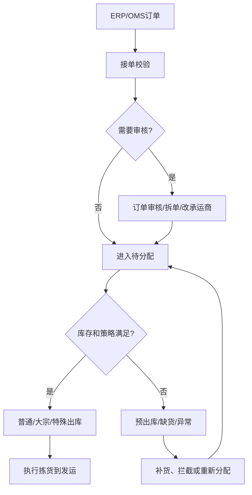
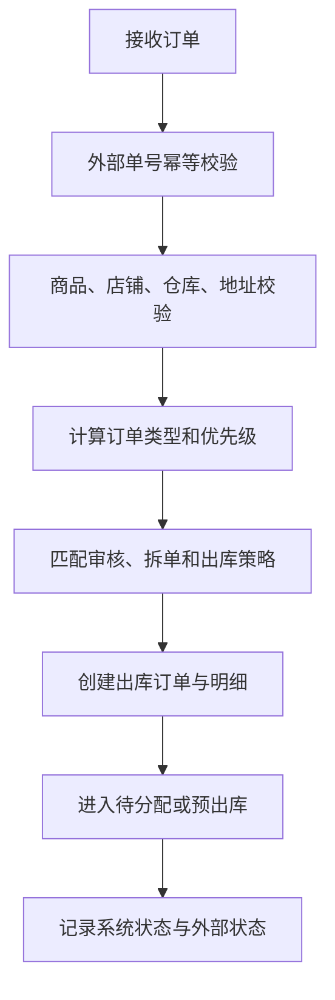
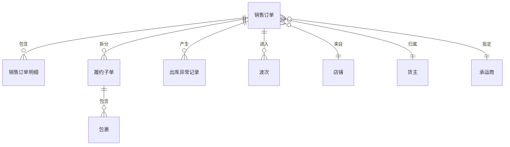

# 06 出库管理设计

## 1. 参考范围

参考 05 章 B2C 出库订单流程、06 章大宗 B2B 出库、09 章特殊出库和即时零售；补充参考 03 章货主策略、出库配置和大宗策略、10 章电子面单。

## 2. 模块目标与业务边界

解决销售订单或外部出库需求进入 WMS 后，如何完成审核、分配、履约和发运。

包含订单接收、订单审核、拆单/合单、出库类型识别、缺货、拦截、部分出库和外部状态回写。

不包含具体拣货、复核、包装、称重和承运商打印执行。

## 3. 角色与业务场景

**参考事实**：ERP 推送订单后先进入待分配；订单可进入普通 B2C 或大宗出库；存在订单审核、零拣、预出库、前置发货、部分出库、拦截和异常处理。

**建议设计**：订单服务接收外部订单，业务审核员处理订单风险，仓库主管决定异常放行，出库执行人员处理后续任务。

### 场景说明

| 使用场景 | 触发时机与参与者 | 为什么要用出库管理 | WMS 解决的问题 | 结果 | 类型 |
|---|---|---|---|---|---|
| 电商零拣 | OMS 推送单件或少量商品订单 | 订单量大、时效短，不能逐单人工协调 | 统一接单、审核、分配和状态回写 | 订单进入可执行履约链路 | 参考事实＋归纳判断 |
| 大宗 B2B | 整箱、整托或大数量订单 | 作业颗粒度、运输和部分出库规则不同 | 识别订单形态并进入大宗策略 | 支持拆任务、部分出库或简化环节 | 参考事实 |
| 缺货接单 | 业务允许先接单、库存后补 | 直接拒单损失订单，直接分配又会产生假承诺 | 进入预出库/缺货队列，库存满足后再流转 | 订单状态透明，可继续履约 | 参考事实＋建议设计 |
| 订单拦截/取消 | 客户退款、地址变更或外部取消 | 已进入 WMS 的订单不能无痕消失 | 按订单所处阶段决定是否挂起、释放或反向处理 | 外部状态与仓内作业一致 | 参考事实＋归纳判断 |
| 多仓/多货主履约 | 订单需要按仓库、货主或店铺处理 | 订单可能被错误仓库或货主接收 | 在接单时校验归属和适用策略 | 防止越权、串货和错发 | 建议设计 |

## 4. 业务流程图

## 5. 系统流程图

## 6. 实体对象与单据

## 7. 单据状态与操作矩阵

待分配、预出库、大宗出库、挂起、拦截和发货失败是参考事实；“审核后统一进入待分配”等状态关系属于我们的归纳或建议设计。

| 对象 | 状态 | 进入条件 | 可执行操作 | 结果 |
|---|---|---|---|---|
| 出库订单 | 待审核 | 配置开启接单审核 | 审核、拆单、改承运商、拦截 | 进入待分配或异常 |
| 出库订单 | 待分配 | 接单成功且未生成波次 | 生成波次、打到零拣、取消、拦截 | 进入出库执行或关闭 |
| 出库订单 | 预出库 | 允许缺货接单但库存不足 | 等待补货、取消、拦截 | 库存满足后重新流转 |
| 出库订单 | 大宗出库 | 命中大宗策略 | 拆分任务、部分出库、装箱 | 进入大宗执行 |
| 出库订单 | 已出库/已关闭 | 发运成功或拦截确认 | 查询、追溯 | 不再正常作业 |
| 异常订单 | 挂起、拦截、发货失败 | 外部变更或内部失败 | 通知处理、改承运商、重试 | 恢复、关闭或重新分配 |

### 单据、任务与数量关系

| 上游对象 | 下游对象 | 可能关系 | 关系说明 | 类型 |
|---|---|---:|---|---|
| 外部订单 | WMS 销售订单 | 1:1 | 同一来源系统和外部单号原则上只对应一张 WMS 主订单，重复推送走幂等 | 参考事实＋建议设计 |
| 销售订单 | 销售订单明细 | 1:N | 一张订单有多条 SKU 行，数量和履约状态按明细累计 | 参考事实＋建议设计 |
| 销售订单 | 履约子单 | 1:N | 按仓库、货主、包裹或部分履约拆分；是否拆新单或仅生成履约批次待确认 | 参考事实＋待确认 |
| 销售订单 | 波次 | 0:1 或 0:N | 一个订单可能未命中波次、进入零拣，或因部分履约进入多次波次 | 参考事实＋建议设计 |
| 销售订单 | 出库异常记录 | 1:N | 同一订单可能先挂起、后拦截或发生多次处理记录，异常不可覆盖历史 | 建议设计 |
| 履约子单 | 包裹/发运单 | 1:N | 一个履约子单可多包裹；是否一包裹一发运单取决于承运商模式 | 参考事实＋待确认 |
| 销售订单 | 拣货任务 | 0:N | 订单可能拆到多个库区、容器和作业任务 | 参考事实＋归纳判断 |

### 状态动作补充矩阵

| 单据/对象 | 当前状态/动作 | 操作前提 | 操作后的状态 | 是否生成任务、流水或关联单据 | 是否允许取消、撤销或反向处理 |
|---|---|---|---|---|---|
| 出库订单 | 接收/审核通过 | 外部单号幂等、商品、仓库、地址和承运商有效 | 待分配 | 可生成拆单/波次匹配记录，不直接扣实际库存 | 待分配前可取消；已生成任务按执行节点处理 |
| 出库订单 | 进入预出库 | 允许缺货但库存不足 | 预出库 | 可生成缺货/补货关联，不应生成实际出库流水 | 可取消或拦截；释放/保留锁定待统一规则 |
| 出库订单 | 生成波次/零拣 | 策略命中或人工选择 | 待拣/执行中 | 生成波次和拣货任务，可能产生库存锁定 | 波次撤销回待分配；锁定释放需同步处理 |
| 出库订单 | 部分出库 | 允许部分履约且已完成对应任务 | 部分出库 | 生成履约子单/包裹和相应库存流水 | 未出库部分可取消；已出库部分只能走售后/反向业务 |

## 8. 库存影响

间接影响。订单接收通常不直接扣减实际库存；分配可能锁定或预占可用库存，拣货和出库的实际扣减时点需由库存模块统一定义。

参考资料明确描述了订单推送后锁定数量增加、可用数量减少，以及拣货后锁定数量和实际数量变化；这些规则需要在 08、09 模块统一固化。

## 9. 异常与逆向流程

适用：

- 订单退款、地址变更、备注变更可触发挂起或拦截。
- 缺货可以打回待分配、提交零拣、生成波次或进入盘点/调整。
- 大宗订单支持部分出库，但未出库数量、已拣未装箱数量和已装箱数量的归属必须拆分处理。
- 已打印面单后更换承运商，需要作废或回收原面单。
- 已生成子母单的订单召回后，主子单关系如何恢复需要明确。

## 10. 字段与业务逻辑

本节字段模型和状态校验属于建议设计；系统单号、外部单号、订单来源、仓库、货主、店铺、承运商和外部状态均在参考资料中出现。

核心字段：系统单号、外部单号、订单来源、仓库、货主、店铺、收件人和地址、承运商、订单类型、优先级、订单状态、外部状态、审核状态、来源订单、计划数量和已履约数量。

校验重点：商品映射、地址完整性、承运商可用性、库存策略、订单重复、拆单关系、订单是否已打印或已拣货、外部拦截状态。

### 表头字段

| 字段名称 | 字段含义 | 来源/写入时机 | 必填性 | 可修改时点 | 查询/展示/导出 | 校验与下游影响 | 类型 |
|---|---|---|---|---|---|---|---|
| 系统单号/外部单号 | WMS 与来源系统的订单身份 | 接单时生成/接收 | 必填 | 不可改 | 全链路追溯 | 外部单号按来源系统、货主等维度幂等 | 参考事实＋建议设计 |
| 订单来源/订单类型 | 平台、OMS、B2C、B2B 等来源与模式 | 外部推送或规则识别 | 必填 | 进入履约后不可随意改 | 订单池、报表 | 决定审核、波次和作业路径 | 参考事实＋建议设计 |
| 仓库/货主/店铺 | 履约责任和数据范围 | 外部映射或规则计算 | 必填 | 待分配前可修正 | 订单、库存、权限 | 必须有授权且匹配商品 | 参考事实＋建议设计 |
| 收件人/地址 | 发运对象和路由信息 | 外部订单 | 按发运场景必填 | 未打印/未出库前按权限改 | 打印、面单、报表 | 改址可能触发拦截和重新获取面单 | 参考事实＋建议设计 |
| 承运商/优先级 | 运输渠道和履约排序 | 外部订单/审核/策略 | 按场景必填 | 生成面单前可改 | 订单和波次 | 变更可能影响波次、面单和费用 | 参考事实＋建议设计 |
| 系统状态/外部状态 | WMS 履约状态和外部业务状态 | 系统动作/接口回写 | 系统生成 | 不允许直接编辑 | 列表、看板、同步日志 | 两套状态分离，避免相互覆盖 | 参考事实＋建议设计 |

### 明细字段

| 字段名称 | 字段含义 | 来源/写入时机 | 必填性 | 可修改时点 | 查询/展示/导出 | 校验与下游影响 | 类型 |
|---|---|---|---|---|---|---|---|
| SKU/条码/商品名称 | 订单商品身份 | 外部订单或商品映射 | 必填 | 进入作业后只读 | 订单、拣货、报表 | 必须映射启用商品和货主 | 参考事实＋建议设计 |
| 订购数量/已履约数量/剩余数量 | 需求与履约进度 | 外部订单/执行回写 | 订购必填，后两者计算 | 系统累计 | 订单池、看板 | 部分履约必须按明细计算剩余 | 建议设计 |
| 库存属性/批次/序列号要求 | 出库时的库存约束 | 商品与策略带出 | 按商品规则 | 进入作业后只读 | 订单、任务 | 影响分配、拣货和复核校验 | 参考事实＋建议设计 |
| 履约子单关联 | 明细分配到哪个仓/批次/包裹 | 拆单或分配时生成 | 拆分场景必填 | 生成任务后受限 | 订单详情、包裹 | 合计不得超过原订单数量 | 建议设计 |
| 缺货/拦截原因 | 明细未履约原因 | 异常处理时生成 | 异常必填 | 关闭前可补充 | 异常报表 | 决定补货、取消或重新分配 | 参考事实＋建议设计 |

## 11. 功能清单

| 优先级 | 功能 | 目标与上下游影响 |
|---|---|---|
| P0 | 订单接收、幂等、审核和状态 | 建立出库入口 |
| P0 | 待分配、缺货、拦截、取消 | 保证异常可处理 |
| P0 | 普通与大宗出库分流 | 适应不同订单形态 |
| P1 | 拆单、合单、部分出库、预出库 | 提高履约灵活性 |
| P1 | 特殊订单模式和多包裹 | 支撑业务差异 |
| 后续 | 平台专属 JIT、即时零售和复杂换单 | 按渠道扩展 |

### 功能说明与首版取舍

| 优先级 | 功能 | 使用场景 | 解决的问题 | 核心交互/规则 | 生成或影响对象 | 我们的补充说明 |
|---|---|---|---|---|---|---|
| P0 | 订单接收与幂等 | ERP/OMS 持续推送订单 | 重复订单、错误归属和漏单 | 接收、校验、落单、记录失败原因 | 销售订单、接口日志 | 业务状态和同步状态分开 |
| P0 | 待分配订单池 | 订单进入履约前 | 订单无法集中查看和调度 | 按仓库、货主、优先级、时效筛选 | 订单、策略匹配 | 是出库作业的稳定入口 |
| P0 | 审核、拦截、取消 | 地址、商品、库存或售后变更 | 已进入仓库的订单无法安全变更 | 按作业节点限制动作，保留操作原因 | 订单、异常记录、任务 | 不能用直接改状态替代逆向处理 |
| P0 | 普通/大宗分流 | 零拣和整箱整托订单并存 | 所有订单强行走同一路径效率低 | 根据数量/体积/承运商等条件分流 | 订单、波次、任务 | 大宗可跳过哪些环节需按规则配置 |
| P1 | 拆单/合单/部分履约 | 多仓、缺货、多包裹 | 单一订单模型承载不了实际发运 | 保留原单与履约子单关系，数量守恒 | 子单、包裹、发运单 | 首版可先支持拆分，不急于开放任意合单 |
| P1 | 预出库与缺货队列 | 业务允许先接单后补货 | 缺货订单无处管理 | 记录等待原因，库存满足后重新分配 | 订单、补货任务、策略 | 释放/保留锁定口径需统一 |
| 后续 | 渠道专属换单/JIT | 平台特殊履约 | 通用订单字段不足 | 通过扩展模型接入 | 扩展单据、接口日志 | 不污染通用订单主链 |

## 12. 万里牛设计借鉴判断

### 判断标准

| 维度 | 判断问题 |
|---|---|
| 通用性 | 订单池、分流和异常处理是否能覆盖 B2C、B2B 和多货主场景？ |
| 业务价值 | 是否减少漏单、错仓、错货，并让缺货和拦截可管理？ |
| 闭环完整性 | 是否覆盖接单、审核、分配、任务、包裹、发运和外部回写？ |
| 实现成本 | 首版是否能先实现订单主链和明确的部分履约模型？ |
| 边界风险 | 是否依赖特定平台订单状态、售后规则或承运商接口？ |

单据关系的判断以“数量是否守恒、来源是否可追溯、取消是否能反向处理”为核心，不以页面菜单数量作为完整性标准。

### 详细借鉴判断

| 参考设计表现 | 可复用原因 | 我们的改造 | 不能照搬的边界 | 结论/类型 |
|---|---|---|---|---|
| 订单先进入待分配 | 订单接收与现场执行需要解耦 | 建立统一订单池和分配前校验 | 不固定某平台的接单状态名称 | 建议直接借鉴；参考事实＋归纳判断 |
| 普通 B2C 与大宗 B2B 分流 | 订单数量、体积、承运商和作业路径不同 | 用订单类型/策略驱动流程，不复制两套订单模型 | 大宗具体跳过环节的条件待确认 | 建议改造后借鉴；参考事实＋建议设计 |
| 缺货可进入预出库，库存到达后再流转 | 业务需要在缺货时保留订单 | 显式记录等待原因、数量和重新分配条件 | 不默认缺货时锁定一定保留或一定释放 | 建议直接借鉴并补充；参考事实＋待确认 |
| 支持拦截、挂起、发货失败和取消 | 外部变更会贯穿现场履约 | 按作业节点定义可逆与不可逆动作 | 不把外部平台状态直接覆盖 WMS 状态 | 建议直接借鉴；参考事实＋建议设计 |
| 拆单、合单、部分出库 | 实际履约常不是订单一次性完成 | 保留原单、子单、包裹和数量守恒关系 | 合单规则、部分出库单据形态需确认 | 建议改造后借鉴；参考事实＋待确认 |

| 判断 | 内容 |
|---|---|
| 建议直接借鉴 | 待分配作为订单池；普通和大宗分流；异常订单集中处理；外部状态和系统状态分开呈现 |
| 建议改造后借鉴 | 预出库、缺货、拦截和部分出库抽象为订单履约状态与异常动作 |
| 不建议照搬 | 具体平台订单字段、近 7 天默认范围、特定平台售后规则 |
| 我们需要补充 | 订单状态机、部分履约模型、取消边界和外部同步幂等 |
| 资料不足，待确认 | 订单接单、库存预占、生成波次和获取面单的先后关系 |

## 13. 跨模块依赖与待确认问题

1. 订单是否允许在拣货、复核、包装和出库各节点取消。
2. 部分出库是拆分为新订单、发货单，还是同一订单产生多次履约。
3. 订单状态与波次、拣货任务、包裹和运单状态如何映射。
4. 缺货后是否释放预占、保留锁定，还是转为待补货。
5. WMS 是否作为订单状态主系统，还是只回写仓储履约状态。
