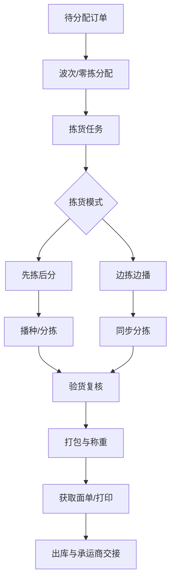
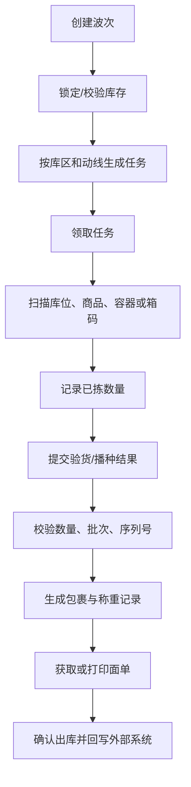
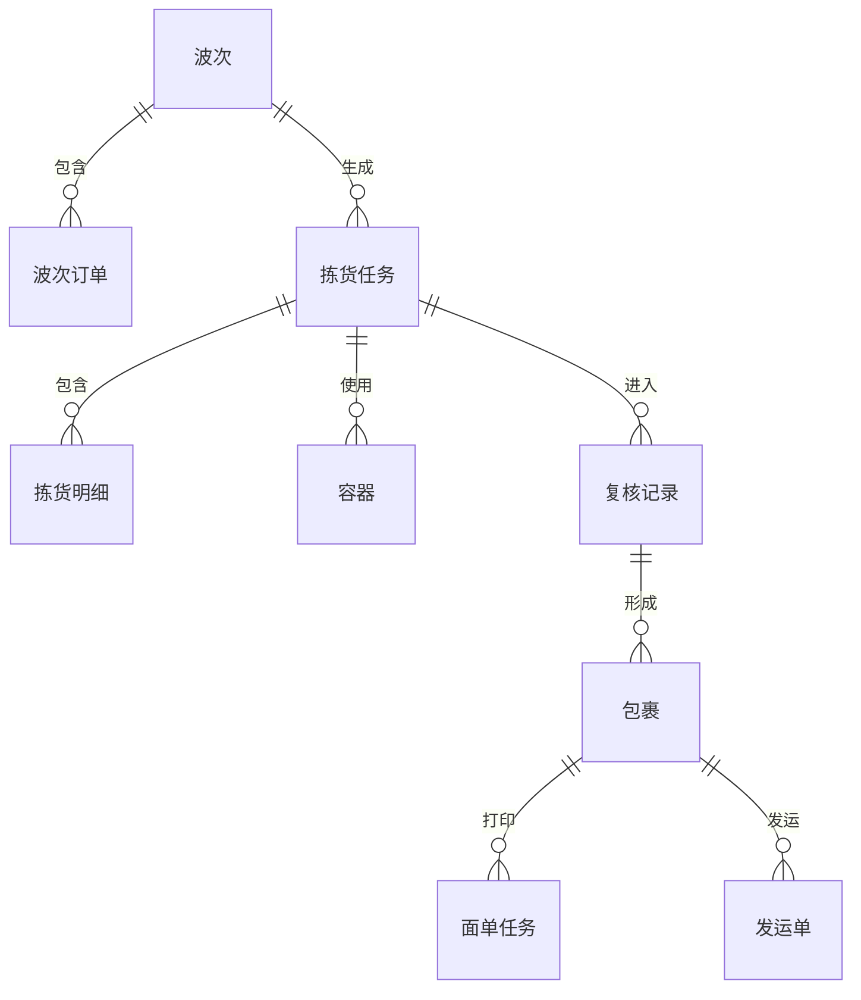

# 07 分配、拣货、复核、包装与发运设计

## 1. 参考范围

参考 03 章波次策略、05 章 B2C 打单/拣货/验货/打包/称重/出库交接/PDA 作业、06 章大宗拣货/称重/装箱、10 章打印与电子面单。

## 2. 模块目标与业务边界

解决已进入 WMS 的出库订单如何被组织成现场可执行的任务，并完成从库位取货到承运商交接。

包含分配、波次、拣货、播种、验货、复核、打包、称重、面单打印和出库交接。

不包含库存主数据维护、订单来源接收和库存盘点。

## 3. 角色与业务场景

**参考事实**：资料覆盖零拣、波次拣货、容器拣货、接力拣货、播种拣货、自由验货、抽检、批量称重、装箱和承运商交接，并同时支持 PC 与 PDA。

**建议设计**：分配员生成波次，拣货员执行取货，复核员核对商品，包装员完成包裹，发运员交接承运商。

### 场景说明

| 使用场景 | 触发时机与参与者 | 为什么要用执行作业 | WMS 解决的问题 | 结果 | 类型 |
|---|---|---|---|---|---|
| 单件/少量零拣 | B2C 订单进入待分配 | 订单多、每单商品少，逐单拣货路径重复 | 以波次、零拣或容器组织任务 | 提高单位时间拣货量 | 参考事实＋归纳判断 |
| 批量拣货后播种 | 多订单商品集中在同一库区 | 先拣后分可能出现错播、漏播 | 以容器、订单格口和扫描核对完成播种 | 商品正确分配到订单 | 参考事实＋建议设计 |
| 复核/验货 | 拣货完成后发运前 | 错拣、漏拣无法在客户收货后补救 | 按订单、商品、数量、批次或序列号核验 | 形成可包装的准确货物 | 参考事实＋归纳判断 |
| 多包裹包装 | 一个履约单超过单箱容量或需分箱 | 包裹、商品和运单关系容易丢失 | 在复核结果上拆包、称重并绑定面单 | 每个包裹可独立发运追踪 | 参考事实＋建议设计 |
| 称重和面单 | 发运前需要运费、路由和追踪号 | 重量错误或面单错贴会导致发运失败 | 记录实重、获取/打印面单并校验包裹 | 形成可交接的发运包裹 | 参考事实＋建议设计 |
| 拣货差异/打印失败 | 现场短拣、设备异常或面单失败 | 直接完成会造成库存、订单和包裹不一致 | 以异常记录、重试、作废或回退处理 | 业务对象可继续或安全关闭 | 参考事实＋归纳判断 |

## 4. 业务流程图

## 5. 系统流程图

## 6. 实体对象与单据

## 7. 单据状态与操作矩阵

待拣货、待验货、待打包、待称重、待出库以及打印失败等状态来自参考事实或章节标题；统一包裹状态和任务状态属于建议设计。

| 对象 | 状态 | 进入条件 | 可执行操作 | 结果 |
|---|---|---|---|---|
| 波次 | 待打印/待拣货、作业中、完成、作废（部分为建议） | 订单命中波次策略 | 打印、撤销、领取、拣货 | 生成拣货任务或回待分配 |
| 拣货任务 | 待领取、作业中、部分完成、完成 | 波次拆分或零拣生成 | 领取、解绑、部分提交、完成 | 进入验货/分拣 |
| 验货任务 | 待验货、作业中、已完成（建议） | 拣货提交 | 扫码、报缺、提交 | 进入打包或异常 |
| 包裹 | 待打包、待称重、待出库、已出库、作废（建议） | 验货/装箱生成 | 编辑、打印、作废、补打 | 生成运单或出库结果 |
| 打印任务 | 待发送、打印中、完成、失败、暂停（参考事实/建议结合） | 触发打印 | 重试、暂停、继续 | 更新打印标记 |

### 单据、任务与数量关系

| 上游对象 | 下游对象 | 可能关系 | 关系说明 | 类型 |
|---|---|---:|---|---|
| 出库订单 | 波次订单 | 0:1 或 0:N | 订单可能走零拣、不进波次，或因拆分/重试进入多个履约批次 | 参考事实＋建议设计 |
| 波次 | 拣货任务 | 1:N | 按库区、路线、容器、商品或人员拆分任务 | 参考事实＋归纳判断 |
| 拣货任务 | 拣货明细 | 1:N | 任务明细保留来源订单行、库位、计划和实拣数量 | 参考事实＋建议设计 |
| 拣货任务 | 复核记录 | 1:N | 可按容器、订单或工作台形成复核记录 | 参考事实＋建议设计 |
| 复核记录 | 包裹 | 1:N | 一次复核结果可分成多个包裹；包裹内明细数量必须守恒 | 参考事实＋建议设计 |
| 包裹 | 面单任务 | 1:N | 可能有首次打印、补打或作废后重打记录；有效面单只能有明确一张 | 参考事实＋建议设计 |
| 包裹 | 发运单 | 1:1 或 1:N | 普通场景一包裹一发运单，多承运商或多标签场景待确认 | 参考事实＋待确认 |
| 出库订单 | 库存流水 | 1:N | 库存流水按分配、拣货、出库等事务节点产生，不等于任务行数 | 建议设计＋待确认 |

### 状态动作补充矩阵

| 单据/对象 | 当前状态/动作 | 操作前提 | 操作后的状态 | 是否生成任务、流水或关联单据 | 是否允许取消、撤销或反向处理 |
|---|---|---|---|---|---|
| 波次 | 生成/发布 | 订单满足策略和库存前置条件 | 待拣货 | 生成一个或多个拣货任务，库存是否锁定由统一口径决定 | 未开始可撤销并回待分配；已作业需差异处理 |
| 拣货任务 | 提交实际数量 | 领取锁有效，扫描和数量校验通过 | 作业中/部分完成/完成 | 生成拣货事件，实际库存是否扣减待统一；完成后进入复核 | 可解绑；已拣数量不能无痕退回 |
| 复核任务 | 复核通过 | 商品、数量、批次/序列号与订单一致 | 待打包 | 生成复核记录，可生成包裹 | 未包装可取消并回异常；已出库需反向处理 |
| 包裹 | 称重/打印/确认出库 | 包裹明细完整，面单有效，重量校验通过 | 待出库/已出库 | 生成称重、面单任务和出库库存流水 | 未出库可作废重包；已出库不能直接撤销 |

## 8. 库存影响

直接影响。建议将“分配锁定”“拣货确认”“出库确认”分别建模：

- 分配：减少可用量，增加预占/锁定量；
- 拣货：记录作业中数量，是否减少实际库存需统一确认；
- 出库：减少实际库存，释放未完成锁定；
- 取消、报缺和作废包裹：按已拣、已装箱和已出库阶段分别释放或冲销。

## 9. 异常与逆向流程

适用：缺货、拣货差异、错货、漏货、称重超差、打印失败、面单回收、包裹作废、订单拦截和承运商交接失败。

任何逆向操作都要记录原任务、原包裹、原运单和实际处理数量，不能只把订单状态改回上一环节。

## 10. 字段与业务逻辑

本节字段、任务并发和库存阶段划分属于建议设计；波次号、任务号、库区、库位、容器、操作员、数量、包裹、重量和运单号来自参考事实。

核心字段：波次号、波次策略、任务号、库区、库位、容器、拣货员、计划数量、已拣数量、复核数量、包裹号、箱号、重量、体积、承运商、运单号和各环节时间。

规则重点：任务领取互斥、库位排序、扫描顺序、序列号登记、箱规换算、称重误差、面单模板、包装耗材和承运商路由。

### 表头字段

| 字段名称 | 字段含义 | 来源/写入时机 | 必填性 | 可修改时点 | 查询/展示/导出 | 校验与下游影响 | 类型 |
|---|---|---|---|---|---|---|---|
| 波次号/任务号 | 执行批次和任务身份 | 分配时系统生成 | 必填 | 不可改 | 任务、看板、日志 | 作为订单、任务和流水关联键 | 参考事实＋建议设计 |
| 作业模式 | 零拣、先拣后分、边拣边播等 | 策略命中 | 必填 | 开始执行后不可改 | 波次和绩效 | 决定任务拆分及后续环节 | 参考事实＋建议设计 |
| 仓库/库区/作业区域 | 现场执行范围 | 分配计算 | 必填 | 任务开始后不可改 | 任务列表、看板 | 影响路径和人员可见范围 | 参考事实＋建议设计 |
| 领取人/设备/容器 | 当前责任和作业载体 | 领取或绑定时写入 | 按作业模式 | 可解绑但需保留历史 | 任务和轨迹 | 领取互斥，避免重复提交 | 参考事实＋建议设计 |
| 任务状态/进度 | 待拣、作业中、完成等 | 系统累计更新 | 系统生成 | 只能通过作业动作改变 | 看板、来源单 | 已作+剩余应等于计划量 | 参考事实＋建议设计 |
| 包裹/发运汇总 | 包裹数、重量、承运商、运单 | 包装/称重/面单时写入 | 发运前必填 | 出库后只读 | 发运、物流、报表 | 包裹和运单状态必须一致 | 参考事实＋建议设计 |

### 明细字段

| 字段名称 | 字段含义 | 来源/写入时机 | 必填性 | 可修改时点 | 查询/展示/导出 | 校验与下游影响 | 类型 |
|---|---|---|---|---|---|---|---|
| 来源订单行 | 任务对应订单明细 | 波次生成 | 必填 | 任务开始后只读 | 订单、任务追溯 | 数量合计不得超过来源剩余量 | 建议设计 |
| 拣货库位/目标容器 | 取货位置和承载物 | 分配/领取时生成 | 必填 | 提交前可按规则调整 | PDA、任务 | 库位状态、库存和容器必须有效 | 参考事实＋建议设计 |
| 计划拣货量/实际拣货量 | 作业目标和结果 | 分配/扫码提交 | 必填 | 实际量由提交累计 | 任务、差异报表 | 短拣必须记录原因，不可静默完成 | 参考事实＋建议设计 |
| 批次/序列号 | 被拣库存身份 | 分配或扫描 | 按商品规则必填 | 提交后只读 | 复核、追溯 | 必须与库存和出库策略一致 | 参考事实＋建议设计 |
| 复核数量/播种数量 | 复核或订单分配结果 | 复核/播种提交 | 按模式必填 | 提交后受限 | 工作台、异常 | 不能超过实际拣货量 | 建议设计 |
| 包裹明细/包装耗材 | 商品进入哪个包裹及使用耗材 | 包装操作 | 发运前必填 | 出库后只读 | 包裹、耗材、费用 | 包裹数量必须与复核结果守恒 | 建议设计 |
| 实际重量/运单号 | 发运核算和追踪身份 | 称重/面单接口 | 发运场景必填 | 面单生成后受限 | 物流、报表 | 重量超差、重复运单需阻止 | 参考事实＋建议设计 |

## 11. 功能清单

| 优先级 | 功能 | 目标与上下游影响 |
|---|---|---|
| P0 | 波次/零拣、任务领取、拣货、复核、包装、出库 | 完成出库主链 |
| P0 | 数量、批次、序列号和容器校验 | 防止错拣错发 |
| P0 | 缺货、解绑、作废、打印失败处理 | 保证异常闭环 |
| P1 | 先拣后分、边拣边播、容器和料筐 | 提高作业效率 |
| P1 | 称重、面单、耗材自动推荐 | 降低发运成本 |
| 后续 | 语音、视觉、自动分拣和机器人协同 | 依赖设备基础 |

### 功能说明与首版取舍

| 优先级 | 功能 | 使用场景 | 解决的问题 | 核心交互/规则 | 生成或影响对象 | 我们的补充说明 |
|---|---|---|---|---|---|---|
| P0 | 波次/零拣分配 | 订单量大或订单简单 | 逐单拣货效率低 | 命中策略后生成批次和任务，未命中有零拣入口 | 波次、拣货任务 | 波次撤销必须回写订单并处理库存占用 |
| P0 | PDA 拣货与任务互斥 | 多人同时作业 | 重复拣货、漏拣和责任不清 | 领取锁、扫描库位/商品/容器、按明细提交 | 拣货任务、库存事务 | 断网、重复提交和版本冲突列为必测 |
| P0 | 复核/验货 | 拣货完成后发运前 | 错货和漏货流向客户 | 按订单、商品、数量、属性和序列号核验 | 复核记录、异常 | 复核通过才允许进入包装 |
| P0 | 包装、称重与发运 | 多包裹或承运商要求 | 货物、箱子、重量、面单关系断裂 | 建包裹、装箱、称重、获取/打印面单、交接 | 包裹、面单任务、发运单 | 先明确哪个节点是实际出库记账点 |
| P0 | 差异和作废处理 | 短拣、错拣、面单失败 | 改状态无法还原现场事实 | 记录差异数量、原因、原任务和补偿动作 | 异常、任务、库存流水 | 作废包裹不得让商品无主 |
| P1 | 先拣后分/边拣边播 | 批量订单和同品集中 | 拣货与分拣效率难兼顾 | 以作业模式模板组织任务和容器 | 波次、容器、播种结果 | 模式是策略参数，不应复制整套页面 |
| P1 | 耗材和承运商路由 | 包装成本和运输渠道管理 | 耗材浪费、错选承运商 | 按商品/包裹/订单条件推荐并允许授权修改 | 耗材记录、发运单 | 费用结算属于后续模块边界 |
| 后续 | 自动分拣/语音/视觉 | 高吞吐仓库 | 人工作业成为瓶颈 | 设备任务和人工兜底 | 设备任务、接口日志 | 依赖现场设备和数据，不作首版前提 |

## 12. 万里牛设计借鉴判断

### 判断标准

| 维度 | 判断问题 |
|---|---|
| 通用性 | 多种拣货、复核、包装模式能否抽象为统一执行链？ |
| 业务价值 | 是否真实降低行走、错拣、错发和交接成本？ |
| 闭环完整性 | 是否覆盖波次、任务、容器、包裹、面单、发运和异常？ |
| 实现成本 | 首版是否先打通人工 PC/PDA，再接自动化设备？ |
| 边界风险 | 是否依赖特定平台面单、设备或仓库布局？ |

判断现场功能时，必须把“按钮可操作”与“数量、库存、包裹和外部状态已闭环”分开验收。

### 详细借鉴判断

| 参考设计表现 | 可复用原因 | 我们的改造 | 不能照搬的边界 | 结论/类型 |
|---|---|---|---|---|
| 零拣、波次、容器、接力和播种并存 | 订单结构和仓库布局决定最佳作业方式 | 抽象成作业模式，复用任务、容器和校验能力 | 不固定模式名称和数量 | 建议改造后借鉴；参考事实＋建议设计 |
| PC/PDA 共享拣货、验货、打包链路 | 现场执行与管理查询需要同一事实 | 终端差异只在交互，不改变业务结果 | 不照搬快捷键和设备细节 | 建议直接借鉴；参考事实＋归纳判断 |
| 任务可领取、解绑、部分完成 | 多人协作和异常恢复是通用需求 | 增加并发版本、数量守恒和事件日志 | 不从“强制完成”推导库存已完成 | 建议直接借鉴并补充；参考事实＋建议设计 |
| 称重、面单、包裹和承运商分开处理 | 发运需要多个外部和现场事实 | 包裹作为中间对象关联商品、重量、面单和发运 | 不把平台面单流程当所有仓库必需流程 | 建议改造后借鉴；参考事实＋待确认 |
| 打印失败、面单回收等异常可处理 | 发运链路不能只设计成功路径 | 作废、重打、回收保留原任务和面单记录 | 具体外部状态和补打规则需接口确认 | 建议直接借鉴并补充；参考事实＋建议设计 |

| 判断 | 内容 |
|---|---|
| 建议直接借鉴 | 多种拣货模式并存；PC/PDA 共享任务；任务解绑后可重新领取；面单打印作为独立任务处理 |
| 建议改造后借鉴 | 先拣后分、边拣边播、容器拣货抽象为作业模式，而不是多个孤立菜单 |
| 不建议照搬 | 具体波次名称、快捷键、平台打印组件和固定打印流程 |
| 我们需要补充 | 作业数量原子性、任务并发、差异补偿、包裹级库存关系 |
| 资料不足，待确认 | 拣货确认与实际库存扣减的统一时点、任务部分提交后的库存释放规则 |

## 13. 跨模块依赖与待确认问题

1. 波次生成时是否锁库，还是拣货领取时才锁库。
2. 一个订单是否允许多个任务、多个包裹和多次出库。
3. 拣货短缺是否立即释放锁定，还是等待缺货处理。
4. 称重、获取面单和确认出库的先后关系。
5. 包裹作废后的商品、运单和库存如何回到可作业状态。
