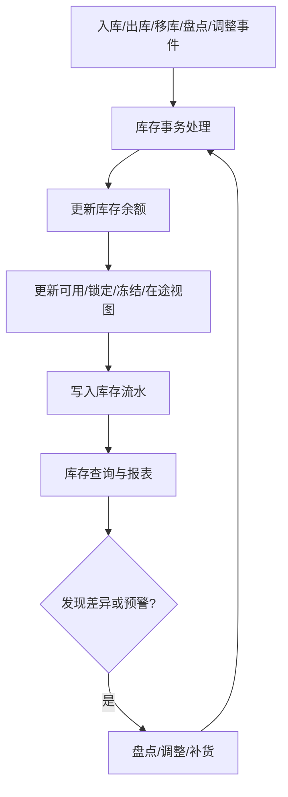
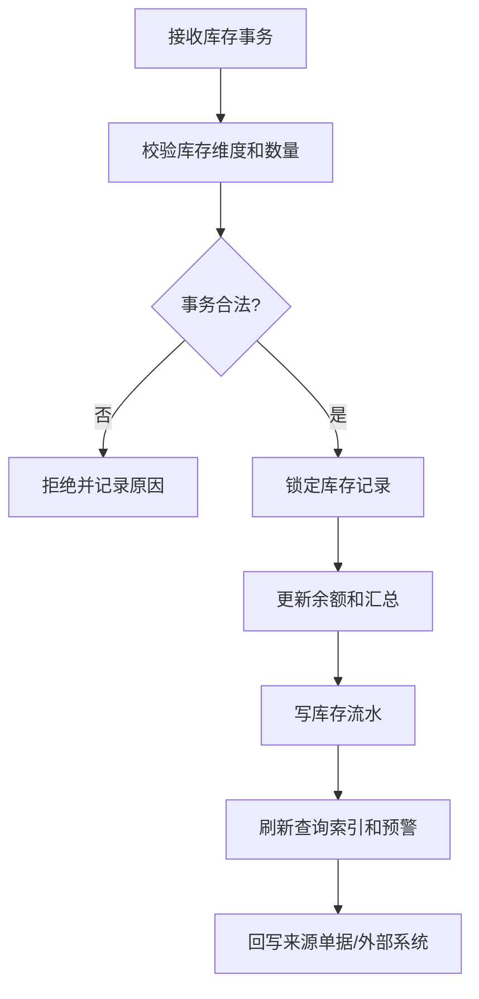
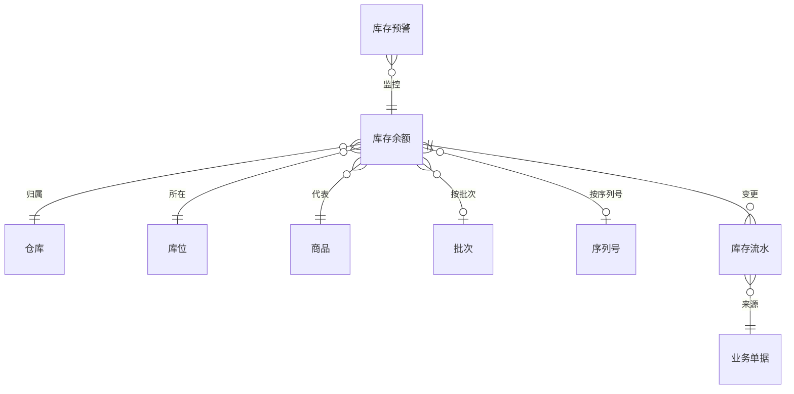

# 08 库存管理设计

## 1. 参考范围

参考 08 章库存状况、库存总量、库位库存、可接单库存、历史库存、库存预警；补充参考 02 章批次/序列号/正次品、07 章库存移动和 12 章出入库报表与库位库存流水。

## 2. 模块目标与业务边界

解决系统库存、库位库存、作业中库存和历史库存之间的查询、核对和追溯问题。

包含库存余额、库存维度、库存流水、可用库存、锁定、冻结、在途、批次和序列号查询。

不包含库存交易单据的创建和具体盘点调整操作。

## 3. 角色与业务场景

**参考事实**：库存总量和库位库存分别展示库存数量；支持历史库存、库位库存、容器查询、订单库位和 PDA 查询；库存详情可追溯关联单据和记账时间。

**建议设计**：仓库人员查询现场库存，库存管理员核对差异，业务人员查看可接单库存，审计人员查看流水。

### 场景说明

| 使用场景 | 触发时机与参与者 | 为什么要用库存管理 | WMS 解决的问题 | 结果 | 类型 |
|---|---|---|---|---|---|
| 现场查库存 | 收货、拣货、盘点人员查询某 SKU/库位 | 只看总库存不知道货在哪里 | 按仓库、库位、容器、批次和序列号查询 | 现场能找到可作业库存 | 参考事实＋归纳判断 |
| 订单可接单判断 | 订单进入分配前 | 实际库存不等于可承诺库存 | 区分实际、可用、锁定、冻结和在途 | 减少超卖和错误分配 | 参考事实＋建议设计 |
| 库存追溯 | 货主或审计查询库存来源 | 发生差异时无法还原变化 | 余额关联库存流水、单据、任务和记账时间 | 可回答何时、因何、由谁改变 | 参考事实＋归纳判断 |
| 批次/序列号管理 | 食品、效期、设备等商品出入库 | 只按 SKU 统计会混淆库存身份 | 将批次、效期、序列号作为查询和校验维度 | 支持追溯和精细出库 | 参考事实＋建议设计 |
| 库存预警 | 库位低于阈值、临期或长期未动 | 业务只能事后发现缺货和积压 | 以余额和历史事件计算预警并跳转处理 | 触发补货、盘点或运营动作 | 参考事实＋建议设计 |
| 账实核对 | 库存管理员定期对账 | 总量、库位量、作业中量可能不一致 | 展示差异来源，不在查询页直接改余额 | 进入盘点或调整闭环 | 参考事实＋归纳判断 |

## 4. 业务流程图

## 5. 系统流程图

## 6. 实体对象与单据

## 7. 单据状态与操作矩阵

实际、可用、锁定、冻结和在途是参考事实中的库存数量概念；库存余额的统一展示层和建议状态不等同于万里牛已有的状态机。

库存余额本身不采用业务单据状态，而采用数量和库存属性；库存交易单据另行管理。

| 对象 | 状态/数量 | 进入条件 | 可执行操作 | 结果 |
|---|---|---|---|---|
| 实际库存 | 账面数量 | 入库生效或出库生效 | 查询、被交易引用 | 记录真实账面变化 |
| 可用库存 | 可分配数量 | 实际库存扣除锁定和冻结 | 分配、查询 | 影响接单和波次 |
| 锁定库存 | 已分配/作业中数量 | 订单或任务占用 | 继续作业、释放 | 不再重复分配 |
| 冻结库存 | 不可正常使用数量 | 质量、异常或人工冻结 | 解冻、查询 | 不参与正常出库 |
| 在途库存 | 尚未入库数量 | 入库预约或外部在途 | 查询、预警 | 不计入实际库存 |

### 对象、余额与流水关系

库存查询不生成交易单据，关系表重点说明“一个事务如何影响多条余额/流水”，而不是把页面查询结果当成实体单据。

| 上游对象 | 下游对象 | 可能关系 | 关系说明 | 类型 |
|---|---|---:|---|---|
| 库存事务 | 库存余额 | 1:N | 一次收发存事务可能拆到多个库位、批次、序列号或库存属性余额 | 建议设计 |
| 库存余额 | 库存流水 | 1:N | 一条余额有多次增减、锁定、冻结和转移记录 | 参考事实＋建议设计 |
| 业务单据 | 库存流水 | 1:N | 一张入库、出库、盘点或调整单可生成多条库存流水 | 归纳判断＋建议设计 |
| 库存余额 | 库存预警 | 1:N | 同一余额可能同时触发低库存、临期或冻结等不同预警 | 建议设计 |
| 库存余额 | 容器库存记录 | 1:N | 若容器参与库存定位，余额可关联容器；容器是否为库存主键待确认 | 参考事实＋待确认 |
| 库位库存 | 库存总量 | N:1 | 总量是多个库位余额的汇总，不是另一笔独立库存变更 | 归纳判断 |

### 状态动作补充矩阵

| 库存对象/动作 | 当前状态/动作 | 操作前提 | 操作后的状态 | 是否生成任务、流水或关联单据 | 是否允许取消、撤销或反向处理 |
|---|---|---|---|---|---|
| 实际库存 | 入库生效 | 来源单据和库存维度有效 | 实际量增加 | 生成入库库存流水并回写来源单 | 已生效不直接取消，通过反向入库/调整处理 |
| 可用库存 | 订单分配 | 可用量满足策略和锁定校验 | 可用量减少、锁定量增加 | 生成分配/拣货任务，是否生成库存流水待确认 | 波次撤销可释放锁定，必须记录原因 |
| 锁定库存 | 拣货或取消 | 原锁定来源有效 | 拣货后释放或取消后回可用 | 生成作业事件/释放流水 | 只能按原来源释放，不能批量清空 |
| 冻结库存 | 冻结/解冻 | 冻结原因、数量和权限有效 | 冻结量增加/释放回可用 | 生成冻结/解冻流水，必要时生成处理任务 | 可分批解冻；释放必须校验冻结来源 |
| 在途库存 | 入库或关闭预约 | 来源预约/外部在途有效 | 转实际或转关闭/取消 | 关联入库单或关闭记录 | 关闭不等于库存自动增加，具体回写待确认 |

## 8. 库存影响

直接适用。参考资料明确：库位库存包含实际、可用、锁定、冻结；库存总量还包含在途；实际库存等于可用、锁定和冻结之和；可用库存扣除待发货/锁定及冻结数量。

建议所有库存维度至少包括仓库、库位、SKU、库存属性、批次、序列号、容器和货主，是否全部启用待确认。

## 9. 异常与逆向流程

适用：库存差异、负库存、重复流水、锁定未释放、冻结误用、库位丢失、批次不一致和序列号重复。

逆向处理必须生成冲销或反向库存事务，禁止直接修改库存余额。查询页面允许展示异常，但不应承担调整逻辑。

## 10. 字段与业务逻辑

本节字段分层、库存流水字段和校验规则属于建议设计；四类/五类库存数量、批次、序列号和库位追溯来自参考事实。

核心字段：仓库、区域、库区、库位、货主、SKU、库存属性、批次、生产日期、过期日期、序列号、容器、实际数量、可用数量、锁定数量、冻结数量、在途数量、最后记账时间。

库存流水字段：事务号、事务类型、来源单据、来源任务、前数量、变更数量、后数量、操作人、操作时间和外部同步结果。

校验：数量不可无依据为负；序列号数量必须与余额一致；批次和库存属性必须匹配；同 SKU 正次品混放限制需要由库位规则决定。

### 表头字段

| 字段名称 | 字段含义 | 来源/写入时机 | 必填性 | 可修改时点 | 查询/展示/导出 | 校验与下游影响 | 类型 |
|---|---|---|---|---|---|---|---|
| 余额记录身份 | 仓库、货主、库位、SKU 等组合身份 | 库存事务首次落账 | 系统必填 | 不可直接修改 | 库存查询、报表 | 主键粒度必须统一，不能随页面变化 | 建议设计＋待确认 |
| 仓库/货主/库位 | 库存归属和物理位置 | 来源单据/作业结果 | 必填 | 通过移库事务改变 | 查询、权限、报表 | 必须是启用且可作业范围 | 参考事实＋建议设计 |
| 库存状态汇总 | 正常、冻结、残次、待处理等属性 | 入库/质检/冻结等事务 | 按业务必填 | 通过交易改变 | 库存、订单可用量 | 决定是否参与分配 | 参考事实＋建议设计 |
| 实际/可用/锁定/冻结/在途数量 | 各数量口径 | 库存服务计算 | 系统计算 | 不可手改 | 库存总量、库位库存 | 公式、舍入和并发更新必须统一 | 参考事实＋建议设计 |
| 最后记账时间 | 最近一次库存事务时间 | 事务提交时生成 | 系统必填 | 不可改 | 库存详情、库龄 | 统计应区分发生时间和记账时间 | 参考事实＋建议设计 |
| 库存异常标记 | 负库存、差异、锁定超时等 | 监控计算 | 系统生成 | 通过处理动作消除 | 预警和看板 | 只标记不直接修正余额 | 建议设计 |

### 明细与流水字段

| 字段名称 | 字段含义 | 来源/写入时机 | 必填性 | 可修改时点 | 查询/展示/导出 | 校验与下游影响 | 类型 |
|---|---|---|---|---|---|---|---|
| SKU/批次/序列号 | 库存身份明细 | 入库、出库、盘点采集 | 按商品规则必填 | 通过反向事务修正 | 库存和追溯 | 不能跨商品、批次或序列号串写 | 参考事实＋建议设计 |
| 来源库位/目标库位 | 转移前后位置 | 移库、补货、上架、拣货 | 转移场景必填 | 提交后只读 | 库位库存、流水 | 库位状态和混放规则校验 | 参考事实＋建议设计 |
| 事务类型/来源单据/任务 | 变化原因和来源 | 库存事务提交 | 必填 | 不可改 | 流水、审计 | 必须可追溯到原业务对象 | 建议设计 |
| 变更前/变更数量/变更后 | 审计用数量快照 | 事务提交时生成 | 系统必填 | 不可改 | 流水和报表 | 必须满足前后数量守恒 | 建议设计 |
| 锁定/冻结原因 | 数量不能正常使用的原因 | 分配或冻结动作 | 有锁定/冻结必填 | 释放通过反向动作 | 预警和详情 | 只能释放本来源的占用 | 建议设计＋待确认 |
| 外部同步结果 | 是否已回写 ERP/OMS | 事务完成后生成 | 对接场景必填 | 失败可重试但保留历史 | 接口日志 | 同步失败不应伪装成库存成功 | 建议设计 |

## 11. 功能清单

| 优先级 | 功能 | 目标与上下游影响 |
|---|---|---|
| P0 | 库存总量、库位库存和可用库存查询 | 支撑作业决策 |
| P0 | 四类库存数量与在途视图 | 统一数量口径 |
| P0 | 库存流水与来源追溯 | 支撑审计和差异处理 |
| P0 | 批次、序列号、正次品查询 | 支撑精细库存 |
| P1 | 历史库存、库龄和预警 | 支撑运营分析 |
| 后续 | 预测库存、智能补货和库存健康评分 | 依赖稳定历史数据 |

### 功能说明与首版取舍

| 优先级 | 功能 | 使用场景 | 解决的问题 | 核心交互/规则 | 生成或影响对象 | 我们的补充说明 |
|---|---|---|---|---|---|---|
| P0 | 总量与库位库存查询 | 现场找货、管理者看账 | 总量和位置口径不一致 | 支持按仓库、货主、SKU、库位、批次查询 | 库存余额、查询模型 | 页面显示必须注明统计时点 |
| P0 | 可用/锁定/冻结/在途视图 | 接单、分配和异常处理 | 实际库存被误当可承诺库存 | 以统一公式展示各数量，不允许页面自行计算 | 库存余额、订单分配 | 公式和扣减时点必须在基线统一 |
| P0 | 库存流水追溯 | 差异、投诉和审计 | 不知道库存为何变化 | 从余额下钻到单据、任务、操作人和时间 | 库存流水、操作日志 | 流水只追加，不直接编辑 |
| P0 | 批次/序列号/库存属性查询 | 追溯、临期、正次品管理 | 库存身份丢失 | 按商品规则展示和校验 | 批次、序列号、库存余额 | 序列号商品的数量一致性需强校验 |
| P1 | 库存预警与历史库存 | 低库存、临期、长期未动 | 问题发现滞后 | 预警可认领、关闭并跳转盘点/补货 | 预警记录、任务 | 预警不是库存调整入口 |
| P1 | 账实差异定位 | 盘点前后对账 | 只看一个总数无法定位差异 | 分仓库、库位、作业中量和流水分析 | 差异记录、盘点任务 | 统计口径需区分实盘和账面 |
| 后续 | 预测和库存健康评分 | 规模化运营 | 固定阈值不足以优化库存 | 基于历史事件和业务预测 | 报表、策略 | 不作为首版库存准确性的前置条件 |

## 12. 万里牛设计借鉴判断

### 判断标准

| 维度 | 判断问题 |
|---|---|
| 通用性 | 库存维度和数量口径能否覆盖普通仓、多货主和精细追溯商品？ |
| 业务价值 | 是否能同时支撑接单、作业、盘点和审计？ |
| 闭环完整性 | 是否有余额、流水、来源单、反向处理和并发控制？ |
| 实现成本 | 首版能否先保证账面准确和可追溯，再做预测？ |
| 边界风险 | 是否把参考资料中的特定统计口径误当成通用公式？ |

库存模块是全系统的口径底座。任何“借鉴”都要回到数量变化的触发节点和流水证据，不能只复刻查询页面。

### 详细借鉴判断

| 参考设计表现 | 可复用原因 | 我们的改造 | 不能照搬的边界 | 结论/类型 |
|---|---|---|---|---|
| 总库存与库位库存分层展示 | 管理者看总量，现场需要找位置 | 统一余额模型和汇总口径，支持下钻 | 不照搬页面名称和默认筛选 | 建议直接借鉴；参考事实＋归纳判断 |
| 实际、可用、锁定、冻结、在途分开 | 接单、作业和异常对库存的需要不同 | 明确每种数量的来源、公式和释放节点 | 参考资料中未覆盖的“作业中”口径待确认 | 建议直接借鉴并补充；参考事实＋待确认 |
| 库存详情可追溯单据与记账时间 | 差异处理必须有证据链 | 余额关联流水、任务、操作人和外部同步结果 | 不用查询结果替代事务流水 | 建议直接借鉴；参考事实＋建议设计 |
| 支持批次、序列号、正次品等维度 | 追溯和可用性不能只看 SKU | 以商品管理方式决定库存维度和采集校验 | 不默认所有商品都启用精细维度 | 建议改造后借鉴；参考事实＋建议设计 |
| 库存预警、库龄和历史库存 | 让仓库从事后查询走向主动管理 | 预警跳转补货、盘点或运营处理 | 固定时间范围和统计口径不泛化 | 建议改造后借鉴；参考事实＋归纳判断 |

| 判断 | 内容 |
|---|---|
| 建议直接借鉴 | 库存总量与库位库存分层；库存详情可回溯单据和记账时间；PDA 支持现场查询 |
| 建议改造后借鉴 | 将作业中数量、可接单库存、锁定和冻结统一进库存数量模型 |
| 不建议照搬 | 页面名称、默认查询时间和具体统计口径 |
| 我们需要补充 | 统一库存事务、并发锁、库存快照和余额重算机制 |
| 资料不足，待确认 | 作业中数量是否独立库存状态、在途库存的来源和入账时点 |

## 13. 跨模块依赖与待确认问题

1. 可用库存公式是否固定为实际库存-预占-冻结。
2. 锁定库存与作业中数量是否允许同时存在。
3. 货主、仓库、库位和批次是否都是库存主键维度。
4. 库存冻结是否冻结实际数量、可用数量还是仅限制分配。
5. 库存流水是否允许人工修正，还是只能通过反向单据修正。
