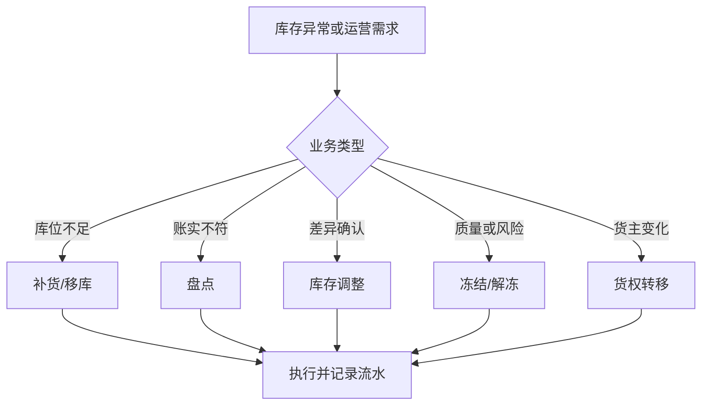
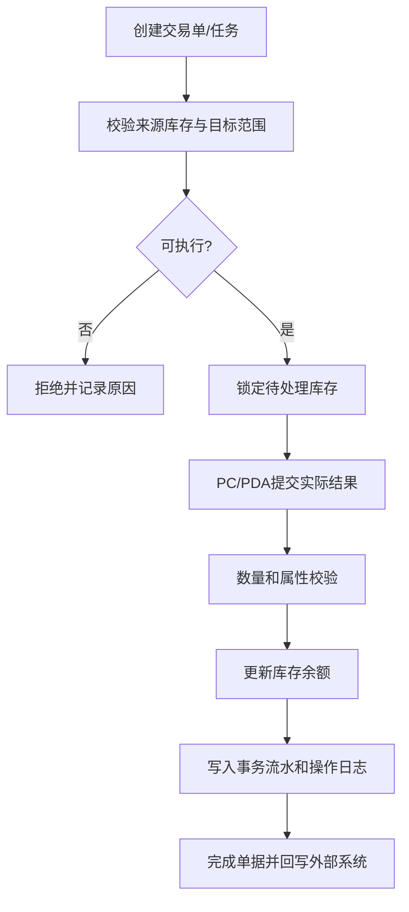
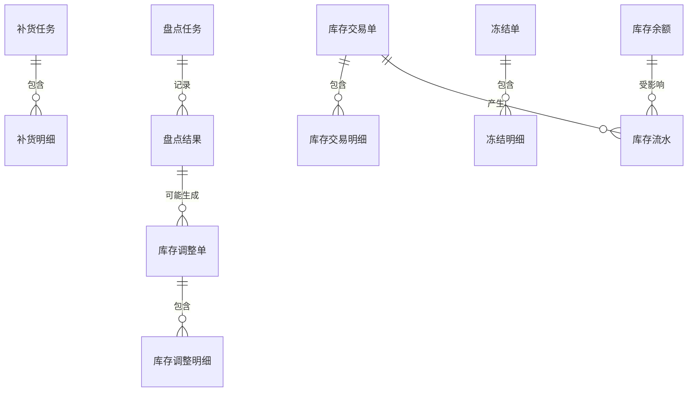

# 09 调拨、盘点、冻结、解冻与库存调整设计

## 1. 参考范围

参考 07 章“库存冻结、库存移动、库存转移、补货上架、盘点任务、正次转换”；08 章“库存差异量、库存调整、货权转移”；03 章盘点策略、补货策略和库存配置。

## 2. 模块目标与业务边界

解决库存已经存在后，如何进行位置转移、属性改变、冻结释放、补货、盘点和账面调整。

包含库内交易、盘点、库存调整、冻结/解冻和货权转移。

不包含采购入库、销售出库和基础资料维护。

## 3. 角色与业务场景

**参考事实**：库存移动可以由 PC/PDA 执行；补货可按库位预警自动生成；盘点任务有待作业、作业中、已完成、已关闭；库存调整用于系统库存与实物不一致；货权转移是 3PL 专属场景。

**建议设计**：库存管理员创建交易，仓库人员执行，主管审核差异，系统服务生成自动补货和盘点任务。

### 场景说明

| 使用场景 | 触发时机与参与者 | 为什么要用这个功能 | WMS 解决的问题 | 结果 | 类型 |
|---|---|---|---|---|---|
| 库内移库 | 库位调整、货物归位或异常搬移 | 货物位置变了但账面位置不能跟着人工修改 | 以来源库位、目标库位和数量形成交易 | 库位变更可追踪，数量总和守恒 | 参考事实＋建议设计 |
| 拣选区补货 | 拣选位低于阈值或订单缺货 | 货在储存区但拣选位无货 | 按策略生成来源到目标的补货任务 | 保障后续拣货供给 | 参考事实＋归纳判断 |
| 周期/动态盘点 | 定期、按库位、按 SKU 或动碰触发 | 全仓停业盘点成本高，差异发现晚 | 生成范围明确的盘点任务并记录实盘 | 差异可进入调整而非直接覆盖 | 参考事实＋建议设计 |
| 冻结/解冻 | 质量、调查、风险或业务管控 | 库存存在但不能被正常分配 | 记录冻结原因、范围和释放动作 | 可用量与冻结量可解释 | 参考事实＋建议设计 |
| 库存调整 | 盘点确认后账实不一致 | 不调整会持续产生错误可用量 | 以审批/调整单按差异变更账面 | 库存与实物重新对齐 | 参考事实＋归纳判断 |
| 货权转移 | 3PL 货主变更 | 仅改货主会丢失原货权轨迹 | 以受控交易转移货主并关联外部单据 | 货权变化有业务依据 | 参考事实＋建议设计 |

## 4. 业务流程图

## 5. 系统流程图

## 6. 实体对象与单据

## 7. 单据状态与操作矩阵

盘点任务的“待作业、作业中、已完成、已关闭”以及补货的“待补货、补货中、已完成”来自参考事实；冻结单、调整单和统一移库状态属于建议设计。

| 对象 | 状态 | 可执行操作 | 操作前提 | 库存结果 |
|---|---|---|---|---|
| 移库任务 | 待作业、作业中、完成、关闭（建议统一） | 领取、提交、关闭 | 来源库存和目标库位有效 | 库位转移，生成流水 |
| 补货任务 | 待补货、补货中、已完成、已关闭 | 补货、强制完成、关闭 | 来源可用库存、目标库位有效 | 来源减少、目标增加 |
| 盘点任务 | 待作业、作业中、已完成、已关闭 | 盘点、强制完成、关闭 | 盘点范围和任务有效 | 可能生成差异调整 |
| 冻结单 | 生效、部分释放、已释放（建议） | 冻结、释放 | 库存存在且权限足够 | 可用量减少或状态冻结 |
| 调整单 | 待确认、已生效、已取消（建议） | 确认、取消 | 差异量和权限有效 | 增加或减少账面库存 |

### 单据、任务与数量关系

| 上游对象 | 下游对象 | 可能关系 | 关系说明 | 类型 |
|---|---|---:|---|---|
| 库存交易单 | 库存交易明细 | 1:N | 一张移库、冻结或调整单可按 SKU、批次、库位和属性拆成多行 | 参考事实＋建议设计 |
| 库存交易单 | 库存流水 | 1:N | 一张交易单可因来源/目标库位、库存状态或批次拆出多条流水 | 建议设计 |
| 补货任务 | 补货明细 | 1:N | 一个补货任务可以包含多个来源库位、目标库位或 SKU | 参考事实＋归纳判断 |
| 盘点任务 | 盘点结果 | 1:N | 可多次盘点或复盘，必须区分初盘、复盘和最终结果 | 建议设计＋待确认 |
| 盘点结果 | 库存调整单 | 0:1 或 1:N | 无差异不生成调整；不同审核批次或库存属性可能拆单 | 归纳判断＋建议设计 |
| 冻结单 | 解冻记录 | 1:N | 一次冻结可分批释放；只能释放本冻结来源的数量 | 建议设计 |
| 跨仓调拨 | 调出单/调入单 | 1:2 或 1:N | 通用跨仓调拨通常需要两端闭环；参考资料未统一其单据拆分 | 建议设计＋待确认 |

### 状态动作补充矩阵

| 单据/任务 | 当前状态/动作 | 操作前提 | 操作后的状态 | 是否生成任务、流水或关联单据 | 是否允许取消、撤销或反向处理 |
|---|---|---|---|---|---|
| 移库/补货任务 | 提交实际数量 | 来源库存、目标库位和数量校验通过 | 作业中/部分完成/完成 | 生成任务事件和库存转移流水 | 未生效可取消；已生效通过反向移库处理 |
| 盘点任务 | 提交盘点结果 | 范围有效，实盘数量和身份完整 | 已完成/待复盘 | 生成盘点结果，不直接生成调整或库存流水 | 未审核可复盘；结果确认后通过调整单修正 |
| 冻结单 | 冻结/释放 | 数量、原因和来源校验通过 | 生效/部分释放/已释放 | 生成冻结/解冻流水和操作日志 | 可分批释放；不能释放非本单冻结量 |
| 库存调整单 | 审核生效 | 差异依据、权限和审批通过 | 已生效 | 生成调整库存流水并回写来源盘点 | 已生效需新建反向调整单，不直接撤销 |

## 8. 库存影响

直接适用：

- 移库/补货：库存数量总和原则上不变，仅改变库位或分配状态。
- 冻结：减少可用库存或增加冻结库存，具体模型需统一。
- 解冻：释放冻结量回到可用量。
- 盘点调整：按差异量增加或减少账面库存。
- 正次转换：数量总和可不变，但库存属性发生改变。
- 货权转移：货主维度转移，资料明确不需要操作出入库单据，但仅限 3PL 场景。

## 9. 异常与逆向流程

适用：

- 补货部分完成时，未补数量必须保留，不能隐式视为完成。
- 作业中任务不能简单关闭，若强制完成必须记录未完成数量。
- 盘点差异必须保留账面量、实盘量和调整量。
- 冻结释放必须校验冻结来源，避免释放其他业务的冻结量。
- 移库失败不得扣减来源库存；提交重试必须幂等。
- 调整单一旦生效，建议通过反向调整单冲销，不直接改余额。

## 10. 字段与业务逻辑

本节字段和盘点、补货、调整的分层规则属于建议设计；来源库位、目标库位、SKU、库存属性、批次、序列号和数量是参考事实或直接归纳。

核心字段：交易单号、交易类型、仓库、货主、来源库位、目标库位、SKU、库存属性、批次、序列号、计划数量、实际数量、差异数量、任务状态、审核状态、操作人和时间。

盘点逻辑必须区分“盘点结果”和“库存调整结果”；补货逻辑必须区分来源锁定、已取数量、已上架数量和剩余数量。

### 表头字段

| 字段名称 | 字段含义 | 来源/写入时机 | 必填性 | 可修改时点 | 查询/展示/导出 | 校验与下游影响 | 类型 |
|---|---|---|---|---|---|---|---|
| 交易/任务/盘点单号 | 业务对象身份 | 创建时系统生成 | 必填 | 不可改 | 单据、任务、流水 | 作为来源和反向单据关联键 | 参考事实＋建议设计 |
| 交易类型 | 移库、补货、盘点、冻结、调整等 | 创建时选择/规则生成 | 必填 | 开始后不可改 | 列表、报表 | 决定字段、库存影响和审批 | 参考事实＋建议设计 |
| 仓库/货主/盘点范围 | 交易或盘点的责任范围 | 用户选择/策略生成 | 必填 | 生效前可改 | 单据、权限 | 必须校验数据权限和库存范围 | 参考事实＋建议设计 |
| 状态/审核状态 | 作业进度和账务生效进度 | 系统动作更新 | 系统生成 | 通过操作改变 | 任务、监控 | 作业完成不必然等于调整生效 | 建议设计 |
| 触发原因/优先级 | 为什么发生以及先后顺序 | 用户/策略/异常生成 | 按场景必填 | 作业前可改 | 看板、审计 | 影响任务排序和异常分析 | 参考事实＋建议设计 |
| 计划时间/完成时间/操作人 | 过程追溯 | 系统记录 | 系统生成 | 不可随意修改 | 绩效和流水 | 统计按实际作业时间 | 建议设计 |

### 明细字段

| 字段名称 | 字段含义 | 来源/写入时机 | 必填性 | 可修改时点 | 查询/展示/导出 | 校验与下游影响 | 类型 |
|---|---|---|---|---|---|---|---|
| SKU/批次/序列号/库存属性 | 被交易或盘点的库存身份 | 库存余额/现场扫描 | 按商品规则必填 | 提交后只读 | 单据、库存、流水 | 必须匹配现存库存和规则 | 参考事实＋建议设计 |
| 来源库位/目标库位 | 库存转移位置 | 交易创建/现场确认 | 移库补货必填 | 提交后只读 | 库位库存、任务 | 来源可用、目标可作业且不违反混放 | 参考事实＋建议设计 |
| 计划数量/实际数量/差异数量 | 交易和盘点数量 | 创建/现场提交/计算 | 计划必填，实际由作业写入 | 生效后只读 | 单据、差异报表 | 数量守恒，差异有原因 | 参考事实＋建议设计 |
| 冻结数量/释放数量/原因 | 冻结生命周期 | 冻结/解冻操作 | 冻结场景必填 | 只能通过释放动作变化 | 库存详情、审计 | 不得释放其他来源冻结 | 建议设计＋待确认 |
| 调整方向/调整原因 | 盘盈、盘亏或其他调整依据 | 调整单创建/审核 | 调整必填 | 生效后只读 | 调整报表 | 需要审批和反向冲销边界 | 参考事实＋建议设计 |
| 剩余数量/任务明细状态 | 部分完成和关闭结果 | 作业提交/关闭 | 系统计算 | 不可手改 | 任务和看板 | 强制关闭必须保留未完成量 | 建议设计 |

## 11. 功能清单

| 优先级 | 功能 | 目标与上下游影响 |
|---|---|---|
| P0 | 库存移动、冻结/解冻、盘点、调整 | 保证库存可维护 |
| P0 | 任务状态和部分完成 | 防止库存与任务脱节 |
| P0 | 库存流水和差异原因 | 支撑审计 |
| P1 | 自动补货、动碰盘点、正次转换 | 提高仓内效率 |
| P1 | 货权转移 | 支撑 3PL |
| 后续 | 智能盘点、动态库位优化 | 依赖历史数据 |

### 功能说明与首版取舍

| 优先级 | 功能 | 使用场景 | 解决的问题 | 核心交互/规则 | 生成或影响对象 | 我们的补充说明 |
|---|---|---|---|---|---|---|
| P0 | 库内移库 | 归位、库位维护、异常搬移 | 位置变化没有账务证据 | 来源—目标—数量—确认，数量总和守恒 | 交易单、库存流水 | 不允许直接编辑库存位置 |
| P0 | 补货 | 拣选区缺货或低于阈值 | 货在储存区却无法拣货 | 来源库存锁定，目标库位上架，保留剩余量 | 补货任务、库存余额 | 自动补货与人工补货共用任务模型 |
| P0 | 盘点 | 周期、动碰或差异触发 | 账实不符无法定位 | 固定范围、实盘提交、复盘/关闭 | 盘点任务、盘点结果 | 盘点结果不直接覆盖账面 |
| P0 | 冻结/解冻 | 质量、调查、风险管控 | 问题库存继续被分配 | 记录冻结来源、数量、原因，按来源释放 | 冻结记录、库存余额 | 冻结和订单锁定不能混为一种原因 |
| P0 | 库存调整 | 盘点确认或授权修正 | 差异无法通过正常作业消除 | 调整单、审批、记账和反向冲销 | 调整单、库存流水 | 调整是账务动作，必须有依据 |
| P1 | 正次品转换 | 质检后属性变化 | 直接改属性无法追溯 | 以交易记录属性转换前后数量 | 交易单、库存余额 | 是否允许跨批次/序列号待确认 |
| P1 | 货权转移 | 3PL 货主变化 | 货权变化与库存脱节 | 关联外部收发/识别码后转移货主 | 货权单、库存流水 | 明确标为 3PL 专属，不泛化 |
| 后续 | 智能盘点/动态优化 | 大规模仓库 | 固定规则效率不足 | 基于历史差异和动碰数据优化 | 盘点策略、任务 | 不作为首版账实闭环前提 |

## 12. 万里牛设计借鉴判断

### 判断标准

| 维度 | 判断问题 |
|---|---|
| 通用性 | 移库、盘点、冻结、调整是否适用于不同仓库和货主？ |
| 业务价值 | 是否解决位置准确、账实一致和异常库存管控？ |
| 闭环完整性 | 是否同时有单据、任务、库存流水、审批和反向处理？ |
| 实现成本 | 首版是否能先实现受控交易和差异闭环？ |
| 边界风险 | 是否把 3PL 货权、固定导入或平台规则误当通用能力？ |

库存交易设计的借鉴标准是“每一次余额变化都有原因、来源和反向路径”，而不是功能菜单越多越好。

### 详细借鉴判断

| 参考设计表现 | 可复用原因 | 我们的改造 | 不能照搬的边界 | 结论/类型 |
|---|---|---|---|---|
| PC/PDA 都可执行库存移动和盘点 | 库存交易既有管理操作也有现场操作 | 统一交易服务和任务模型 | 不照搬终端快捷键和页面差异 | 建议直接借鉴；参考事实＋建议设计 |
| 补货可由库位阈值自动生成 | 拣选区供给是通用 WMS 问题 | 阈值、来源、目标和剩余量显式记录 | 不把具体库区阈值泛化到所有仓库 | 建议直接借鉴并补充；参考事实＋归纳判断 |
| 盘点有待作业、作业中、完成、关闭 | 盘点需要可分批执行和管理 | 区分盘点结果、复盘和调整生效 | 不默认盘点完成就自动改库存 | 建议直接借鉴；参考事实＋待确认 |
| 库存调整用于账实差异 | 账实不一致不能靠正常收发消除 | 以调整单、原因、审批和冲销留痕 | 不允许在查询页直接改余额 | 建议直接借鉴并补充；参考事实＋建议设计 |
| 货权转移作为 3PL 专属场景 | 多货主仓存在货权变化需求 | 单独建模并与外部凭证关联 | 不将 3PL 货权操作作为普通仓默认流程 | 建议改造后借鉴；参考事实＋边界判断 |

| 判断 | 内容 |
|---|---|
| 建议直接借鉴 | 盘点任务状态；补货按库区预警自动生成；PC/PDA 同时执行库内任务；库存调整可导入 |
| 建议改造后借鉴 | 将库存移动、补货、转移和冻结统一为库存交易服务 |
| 不建议照搬 | 3PL 专属货权转移方式、固定导入上限和特定系统识别码匹配 |
| 我们需要补充 | 调整审批、冲销单、冻结来源、并发锁和事务原子性 |
| 资料不足，待确认 | 盘点完成是否自动生效、调整是否必须审批、冻结对可用量的具体影响 |

## 13. 跨模块依赖与待确认问题

1. 调拨是跨仓单据还是库内移库，是否需要出库与入库两端单据。
2. 盘点任务是否锁定库存，盘点期间订单能否继续出库。
3. 冻结和锁定是否是同一库存维度的不同原因。
4. 正次转换是否允许跨库位、跨批次、跨序列号。
5. 库存调整是否通知 ERP，以及不同货主的同步模式。
