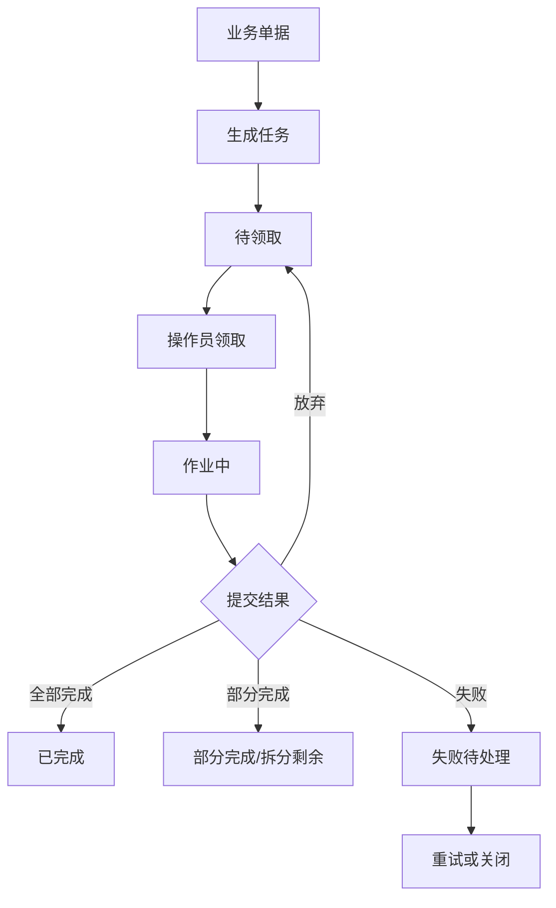
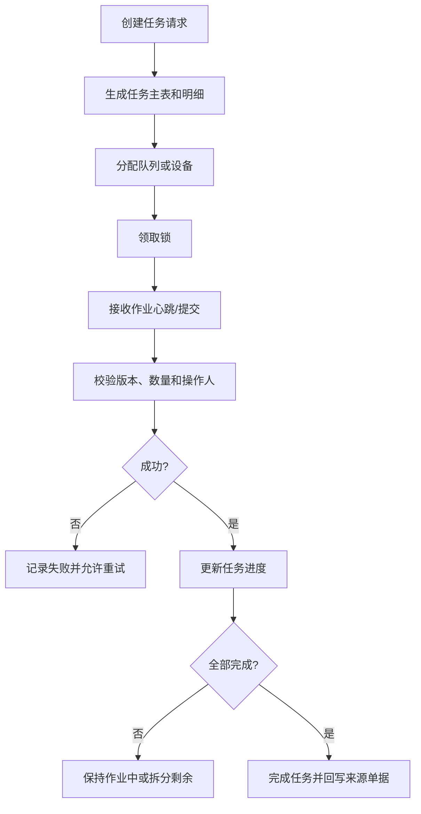
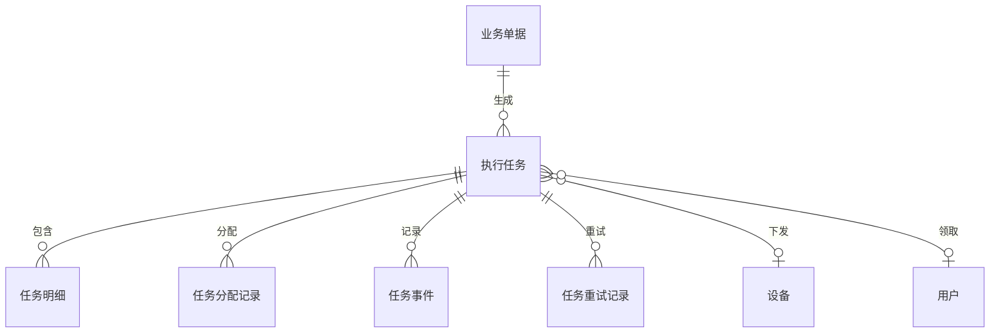

# 10 任务管理设计

## 1. 参考范围

参考 01 章设备任务和系统冻结、03 章波次生成任务与策略任务、04 章分批入库任务、05 章拣货任务和打印任务、06 章大宗任务、07 章补货/移库/盘点/加工任务、10 章打印队列、11 章费用核销系统任务。

## 2. 模块目标与业务边界

解决业务单据和现场作业之间需要异步执行、多人领取、部分完成、重试和追溯的问题。

包含任务创建、拆分、领取、解绑、执行、完成、失败、取消、重试和任务日志。

不包含各业务任务的领域校验和库存计算；任务中心只提供统一任务生命周期和调度能力。

## 3. 角色与业务场景

**参考事实**：资料中存在系统任务、作业任务、设备任务、打印任务和多人领取的任务页面；拣货任务被领取后进入作业中，解绑后可重新领取；部分作业可以拆出新任务。

**建议设计**：任务调度器生成任务，操作员领取，主管转派或关闭，系统服务处理异步任务和重试。

### 场景说明

| 使用场景 | 触发时机与参与者 | 为什么要用任务管理 | WMS 解决的问题 | 结果 | 类型 |
|---|---|---|---|---|---|
| 收发货现场作业 | 单据经过校验，需要人员或设备执行 | 业务单据不能直接描述“谁在何时做什么” | 将单据明细拆成可领取、可提交的任务 | 单据、任务和作业结果可追溯 | 参考事实＋归纳判断 |
| 多人协同拣货 | 一个波次覆盖多个库区或人员 | 多人同时作业容易重复领取 | 任务领取互斥，支持按区域/容器拆分 | 每个任务有明确责任人 | 参考事实＋建议设计 |
| 部分完成 | 现场只完成部分数量或部分库位 | 强行完成会丢失剩余作业 | 保存计划、已完成、剩余和拆分关系 | 剩余任务可继续或转异常 | 参考事实＋归纳判断 |
| 设备异步执行 | WCS、打印或接口任务需等待回传 | 请求已发出不代表业务已完成 | 单独记录发送、处理中、成功、失败和重试 | 外部失败不被伪装成成功 | 参考事实＋建议设计 |
| 任务超时/人员离岗 | 任务被领取但长期无提交 | 任务锁可能阻塞其他人员 | 超时提醒、解绑/回收并保留历史 | 任务可恢复，责任可追溯 | 建议设计＋待确认 |
| 任务回写失败 | 现场完成但来源单据未更新 | 页面显示完成而业务仍停滞 | 分离任务完成和领域回写，支持补偿 | 不重复库存流水或外部通知 | 建议设计 |

## 4. 业务流程图

## 5. 系统流程图

## 6. 实体对象与单据

## 7. 单据状态与操作矩阵

待领取、作业中、部分完成、已完成、解绑和失败重试来自参考事实或其归纳；任务版本号、转派和统一失败状态属于建议设计。

| 状态 | 进入条件 | 可执行操作 | 操作前提 | 后续结果 |
|---|---|---|---|---|
| 待领取/待作业 | 任务创建成功 | 领取、关闭 | 任务有效 | 进入作业中或关闭 |
| 作业中 | 操作员领取 | 提交、解绑、转派 | 当前领取锁有效 | 完成、部分完成或回待作业 |
| 部分完成 | 提交量小于计划量 | 继续作业、拆分剩余 | 剩余明细清晰 | 新任务或原任务继续 |
| 已完成 | 计划量全部完成 | 查询、导出 | 作业结果校验通过 | 回写单据和库存 |
| 失败 | 异步或设备处理失败 | 查看原因、重试、关闭 | 失败可重试 | 成功或终止 |
| 已关闭/已取消 | 管理员或业务取消 | 查询 | 不再允许正常作业 | 是否释放占用由领域模块定义 |

### 单据、任务与数量关系

| 上游对象 | 下游对象 | 可能关系 | 关系说明 | 类型 |
|---|---|---:|---|---|
| 业务单据 | 执行任务 | 1:N | 一个单据可按库区、作业环节、容器、设备或人员拆成多条任务 | 参考事实＋归纳判断 |
| 执行任务 | 任务明细 | 1:N | 一条任务包含一个或多个来源明细及计划/完成数量 | 参考事实＋建议设计 |
| 执行任务 | 任务分配记录 | 1:N | 一条任务可多次领取、解绑和转派，但同一时点只能有一个有效领取人 | 建议设计 |
| 执行任务 | 任务事件/日志 | 1:N | 创建、领取、提交、失败、重试和关闭均保留事件 | 参考事实＋建议设计 |
| 执行任务 | 重试记录 | 1:N | 异步或设备失败可多次重试；重试不应重复领域事务 | 建议设计 |
| 任务明细 | 库存流水 | 0:N | 任务只是执行载体，是否产生库存流水由对应领域操作决定 | 归纳判断＋建议设计 |
| 任务 | 来源单据状态 | N:1 | 多条任务完成后按规则汇总回写来源单据，不能一条任务完成就直接完成主单 | 建议设计 |

### 状态动作补充矩阵

| 单据/任务 | 当前状态/动作 | 操作前提 | 操作后的状态 | 是否生成任务、流水或关联单据 | 是否允许取消、撤销或反向处理 |
|---|---|---|---|---|---|
| 执行任务 | 创建 | 来源单据和领域前置条件有效 | 待领取/待作业 | 生成任务主表、明细和创建事件 | 未领取可关闭；关闭原因必填 |
| 执行任务 | 领取 | 任务可领取且无有效领取锁 | 作业中 | 生成分配记录和领取事件，不直接生成库存流水 | 可解绑回待作业，保留领取历史 |
| 执行任务 | 部分提交 | 实际数量小于计划且差异有依据 | 部分完成/作业中 | 生成提交事件，是否产生库存流水由领域模块决定 | 剩余量可继续或拆新任务 |
| 执行任务 | 完成/回写失败 | 明细完成且领域校验通过 | 已完成/回写异常 | 生成完成事件并回写来源；领域模块决定库存流水 | 完成记录不直接撤销，使用领域反向单据 |
| 执行任务 | 失败重试 | 失败可重试，幂等键不变 | 重试中/成功/终止 | 生成重试记录和日志，不重复有效事务 | 可关闭；关闭后需人工接管或补单 |

## 8. 库存影响

间接影响。任务领取可以产生作业锁或暂时占用，但库存是否变化必须由对应领域事务决定。任务状态变更不能单独代表库存生效。

## 9. 异常与逆向流程

适用：重复领取、领取超时、设备失败、部分完成、任务解绑、强制完成、取消、重试和回写失败。

建议每次提交带任务版本号，防止两个终端同时提交同一任务；任务失败重试不得重复生成库存流水或外部通知。

## 10. 字段与业务逻辑

本节字段、版本控制和幂等要求属于建议设计；任务号、来源单据、仓库、优先级、计划数量、完成数量、领取人、设备和错误原因来自参考资料或直接归纳。

核心字段：任务号、任务类型、来源单据、来源明细、仓库、库区、优先级、状态、计划数量、已完成数量、剩余数量、领取人、领取时间、设备、重试次数、错误码、完成时间和版本号。

任务明细需要保留来源业务行，支持从任务追溯到订单/入库单、库存和操作日志。

### 表头字段

| 字段名称 | 字段含义 | 来源/写入时机 | 必填性 | 可修改时点 | 查询/展示/导出 | 校验与下游影响 | 类型 |
|---|---|---|---|---|---|---|---|
| 任务号/任务类型 | 任务身份和领域分类 | 创建任务时生成 | 必填 | 不可改 | 任务中心、日志 | 决定领域校验和执行页面 | 参考事实＋建议设计 |
| 来源单据/来源系统 | 任务由哪张单据或系统事件产生 | 创建任务时关联 | 必填 | 不可改 | 单据、任务互查 | 必须能追到来源单和明细 | 参考事实＋建议设计 |
| 仓库/库区/作业区域 | 任务执行范围 | 策略/领域服务生成 | 按任务类型必填 | 领取后不可改 | 任务、看板 | 决定人员、设备和库位范围 | 参考事实＋建议设计 |
| 优先级/计划时间 | 调度顺序和时效 | 策略或业务计算 | 按场景必填 | 领取前可调 | 调度和绩效 | 需有排序和超时口径 | 参考事实＋建议设计 |
| 状态/版本号 | 生命周期和并发版本 | 系统更新 | 系统生成 | 只能由操作改变 | 任务、日志 | 防止重复领取和旧终端提交 | 建议设计 |
| 领取人/设备/完成时间 | 当前责任和完成时点 | 领取/完成时写入 | 按模式决定 | 历史不可覆盖 | 绩效、审计 | 解绑要新增事件而非抹掉责任 | 参考事实＋建议设计 |

### 明细字段

| 字段名称 | 字段含义 | 来源/写入时机 | 必填性 | 可修改时点 | 查询/展示/导出 | 校验与下游影响 | 类型 |
|---|---|---|---|---|---|---|---|
| 来源单据行/商品 | 任务对应的业务明细 | 创建任务时复制引用 | 必填 | 作业后只读 | 任务详情、来源单 | 数量不能超过来源剩余量 | 建议设计 |
| 来源库位/目标库位 | 作业位置 | 分配/生成任务时 | 按任务类型必填 | 领取后受限 | PDA、库存 | 库位状态和库存校验 | 参考事实＋建议设计 |
| 计划数量/已完成数量/剩余数量 | 明细级进度 | 创建/提交时计算 | 计划必填 | 系统累计 | 任务、看板 | 数量守恒，部分完成可追踪 | 建议设计 |
| 批次/序列号/容器 | 执行身份约束 | 领域服务或扫描写入 | 按商品/模式必填 | 提交后只读 | 追溯和异常 | 需与库存和来源单匹配 | 参考事实＋建议设计 |
| 失败原因/异常数量 | 失败或差异的事实 | 提交失败/异常时 | 异常必填 | 关闭前可补充 | 异常报表 | 决定重试、补单或人工接管 | 建议设计＋待确认 |
| 幂等键/提交时间 | 防重复提交和过程证据 | 每次提交生成 | 系统必填 | 不可改 | 日志、审计 | 同一提交只能产生一次领域结果 | 建议设计 |

## 11. 功能清单

| 优先级 | 功能 | 目标与上下游影响 |
|---|---|---|
| P0 | 统一任务模型和状态 | 承载各业务作业 |
| P0 | 领取、解绑、部分完成、关闭 | 支撑多人现场协作 |
| P0 | 任务日志、失败原因、重试 | 保证异步可运维 |
| P1 | 优先级、转派、设备下发 | 提高调度能力 |
| P1 | 任务看板和超时预警 | 支撑现场管理 |
| 后续 | 智能派工、路径优化和自动调度 | 依赖历史绩效数据 |

### 功能说明与首版取舍

| 优先级 | 功能 | 使用场景 | 解决的问题 | 核心交互/规则 | 生成或影响对象 | 我们的补充说明 |
|---|---|---|---|---|---|---|
| P0 | 统一任务模型 | 收货、拣货、补货、打印、设备等多类作业 | 每个模块各自定义任务导致状态和日志不一致 | 统一任务头、明细、状态、事件和来源关系 | 所有领域任务 | 领域业务规则仍由对应模块负责 |
| P0 | 领取/解绑/转派 | 多人协同和人员离岗 | 任务被占用却没人继续 | 领取互斥，解绑保留历史，转派有权限 | 任务分配记录 | 首版先实现互斥和可恢复，不做复杂自动派工 |
| P0 | 部分完成与剩余拆分 | 部分收货、短拣、补货不足 | 强制完成丢失未作数量 | 按明细计算已作、剩余和后续任务 | 任务、来源单、库存 | 剩余数量必须能回到待作业或异常队列 |
| P0 | 失败、重试与幂等 | 设备、打印、接口和异步作业 | 重试导致重复库存或重复通知 | 记录失败原因、幂等键、重试次数和结果 | 任务事件、接口日志 | 重试不是简单重新点按钮 |
| P0 | 任务回写 | 现场任务完成后 | 任务完成但单据不变 | 分离任务完成、领域事务成功和外部同步成功 | 来源单据、库存、同步任务 | 需有补偿和对账入口 |
| P1 | 优先级/超时监控 | 高峰期现场调度 | 管理者无法知道堵点 | 按优先级、等待时长、作业时长看板展示 | 看板、绩效 | 超时阈值按任务类型配置 |
| P1 | 设备下发与人工接管 | 自动化仓库 | 设备失败后作业中断 | 设备状态回传，失败可转人工 | 设备任务、作业任务 | 厂商协议放在集成边界 |
| 后续 | 智能派工/路径优化 | 大规模仓库 | 静态派工效率不足 | 结合历史绩效和路径优化 | 任务、绩效、策略 | 不作为首版闭环前提 |

## 12. 万里牛设计借鉴判断

### 判断标准

| 维度 | 判断问题 |
|---|---|
| 通用性 | 任务模型是否能承载人工、设备、打印和系统异步任务？ |
| 业务价值 | 是否提升多人协同、异常恢复和现场透明度？ |
| 闭环完整性 | 是否覆盖来源、领取、提交、失败、重试、回写和流水？ |
| 实现成本 | 首版是否先做好生命周期和幂等，不急于智能调度？ |
| 边界风险 | 是否把领域库存规则错误下沉到通用任务中心？ |

任务中心借鉴的重点是“统一执行载体”，而不是把所有业务都做成同一张页面或同一套库存规则。

### 详细借鉴判断

| 参考设计表现 | 可复用原因 | 我们的改造 | 不能照搬的边界 | 结论/类型 |
|---|---|---|---|---|
| 系统任务、作业任务、设备任务和打印任务并存 | WMS 确实同时存在人工和异步执行 | 统一任务骨架，以任务类型承载领域差异 | 不把所有任务强行使用相同状态含义 | 建议改造后借鉴；参考事实＋建议设计 |
| 任务可领取、解绑、部分完成 | 现场多人协同和中断恢复是通用问题 | 增加领取锁、版本号、事件和剩余量 | 不把解绑直接等同库存释放 | 建议直接借鉴并补充；参考事实＋归纳判断 |
| 设备/打印失败支持重试 | 异步失败是正常运维场景 | 记录幂等键和重试结果，领域事务去重 | 不默认所有失败都可自动重试 | 建议直接借鉴并补充；参考事实＋建议设计 |
| 任务完成回写来源单据 | 现场结果必须回到业务主链 | 分离任务完成、库存生效和外部同步 | 不由任务中心自行决定库存扣减时点 | 建议直接借鉴；归纳判断＋建议设计 |
| 任务页面按业务分组 | 便于不同岗位快速找到工作 | 保留统一数据模型，界面按岗位提供视图 | 不复制多套状态机和重复字段 | 建议改造后借鉴；参考事实＋建议设计 |

| 判断 | 内容 |
|---|---|
| 建议直接借鉴 | 任务中心统一查看不同来源任务；任务领取互斥；支持解绑、部分完成和异步重试 |
| 建议改造后借鉴 | 将系统任务、业务任务、设备任务和打印任务统一为任务类型，而非互相复制页面逻辑 |
| 不建议照搬 | 具体任务名称、隐藏技术开关和固定任务页面分组 |
| 我们需要补充 | 任务版本、幂等、超时回收、转派和领域回写协议 |
| 资料不足，待确认 | 任务关闭是否自动释放库存锁、容器锁和库位锁 |

## 13. 跨模块依赖与待确认问题

1. 任务领取锁的有效期和超时回收规则。
2. 部分完成后是拆新任务还是原任务继续作业。
3. 设备任务失败是否允许人工接管。
4. 任务完成与单据完成、库存生效的映射。
5. 系统任务是否需要用户可见、可取消和可重试。
