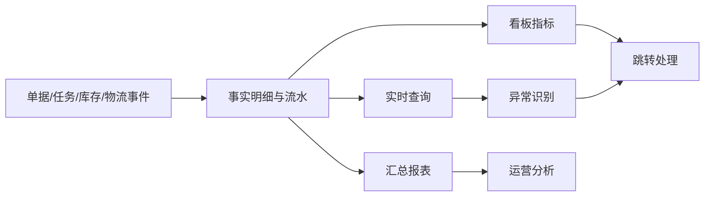
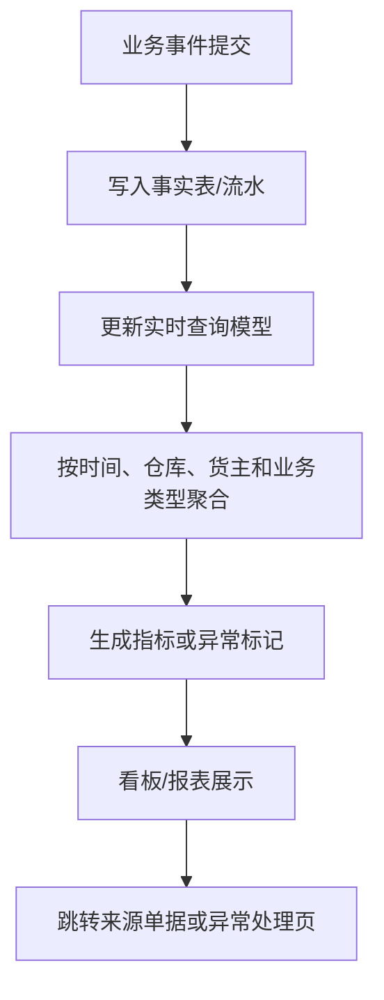
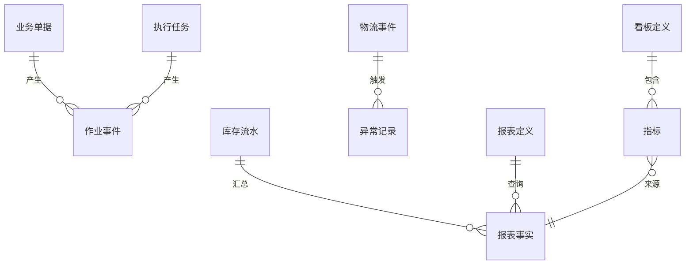

# 11 查询、报表与作业监控设计

## 1. 参考范围

参考 08 章库存查询和预警、11 章物流跟踪与费用查询、12 章仓库看板、公司看板、现场操作看板、出入库报表、绩效报表、库龄、耗材和物流跟踪。

## 2. 模块目标与业务边界

解决仓库管理者无法及时知道“现在有什么、正在处理什么、哪里异常、谁完成了什么”的问题。

包含查询、看板、报表、异常监控、绩效和追溯入口。

不包含交易数据的写入和库存调整本身。

## 3. 角色与业务场景

**参考事实**：仓库看板展示各环节数据，现场看板展示待处理作业和绩效排名；报表覆盖库存、出入库、波次、拣货、入库上架、耗材、库龄和绩效；物流跟踪支持超时和问题件处理。

**建议设计**：仓库主管看现场负荷，库存管理员看账实差异，货主看授权范围内数据，运营人员看趋势，审计人员看明细和流水。

### 场景说明

| 使用场景 | 触发时机与参与者 | 为什么要用查询/监控 | WMS 解决的问题 | 结果 | 类型 |
|---|---|---|---|---|---|
| 现场调度 | 仓库主管查看待收、待拣、待上架和异常 | 只看单据列表不知道现场堵点 | 按任务状态、区域、时效和人员聚合 | 可及时调人、转派或处理异常 | 参考事实＋归纳判断 |
| 库存核对 | 库存管理员发现总量和库位量不一致 | 只看当前余额无法解释变化 | 由余额下钻到流水、单据和任务 | 进入盘点或调整闭环 | 参考事实＋建议设计 |
| 货主/运营分析 | 货主看履约、库龄、出入库和绩效 | 不同角色需要不同粒度和数据范围 | 按仓库、货主、SKU、时间等维度查询 | 支撑运营决策和服务核算 | 参考事实＋归纳判断 |
| 物流异常 | 面单、发运或承运商轨迹异常 | 订单已出库但客户仍未收到 | 汇总物流事件并提供问题件入口 | 可通知、跟进和关闭异常 | 参考事实＋建议设计 |
| 审计追溯 | 对账、投诉或责任认定 | 汇总报表不能作为唯一证据 | 保留明细、操作人、时间和来源 | 形成可复核的事实链 | 参考事实＋建议设计 |
| 指标下钻 | 看板发现某个指标异常 | 指标高低本身不能指导动作 | 从指标跳到明细和处理页 | 查询和业务动作形成闭环 | 建议设计 |

## 4. 业务流程图

## 5. 系统流程图

## 6. 实体对象与单据

## 7. 单据状态与操作矩阵

看板、查询、报表和异常处理入口属于参考事实；“实时/历史快照”和统一报表任务状态属于建议设计。

报表和看板通常不改变交易状态，重点是数据刷新和异常状态。

| 对象 | 状态 | 可执行操作 | 结果 |
|---|---|---|---|
| 查询结果 | 实时/历史快照 | 筛选、导出、跳转 | 不改变业务数据 |
| 异常记录 | 未处理、处理中、已恢复、已关闭（建议） | 通知处理、认领、关闭 | 更新异常处理记录 |
| 报表任务 | 排队、生成中、成功、失败（建议） | 下载、重试 | 生成导出文件 |
| 看板指标 | 当前快照 | 点击下钻 | 跳转明细或处理页面 |

### 来源对象与数量关系

查询、报表和看板通常是读取模型，不应被描述成“生成业务单据”。这里用来源关系说明一个事实如何被多个视图使用。

| 来源对象 | 下游对象 | 可能关系 | 关系说明 | 类型 |
|---|---|---:|---|---|
| 业务单据 | 作业事件 | 1:N | 单据创建、审核、取消、完成等动作形成事件 | 参考事实＋建议设计 |
| 执行任务 | 作业事件 | 1:N | 领取、提交、失败、重试和关闭均可成为事实事件 | 参考事实＋建议设计 |
| 库存流水 | 报表事实 | 1:N | 同一流水可以服务库存明细、出入库报表和审计视图 | 归纳判断＋建议设计 |
| 报表事实 | 指标 | N:1 或 N:N | 一个指标由多个事实聚合，一个事实也可参与多个指标 | 建议设计 |
| 物流事件 | 异常记录 | 1:N | 同一物流对象可能多次发生催件、超时或问题件事件 | 参考事实＋建议设计 |
| 指标/异常记录 | 下钻对象 | 1:N | 看板只提供入口，实际处理要回到订单、任务或流水 | 建议设计 |

### 状态动作补充矩阵

| 对象/动作 | 当前状态/动作 | 操作前提 | 操作后的状态 | 是否生成任务、流水或关联对象 | 是否允许取消、撤销或反向处理 |
|---|---|---|---|---|---|
| 查询结果 | 筛选/下钻 | 用户有数据权限 | 仍为查询状态 | 不生成业务任务或库存流水，只生成访问/导出日志 | 可取消查询或导出任务 |
| 异常记录 | 认领/处理 | 异常来源仍有效 | 处理中/已恢复/已关闭 | 可跳转或生成处理任务，不直接改库存 | 可重新打开；关闭不抹除历史 |
| 报表任务 | 导出/重试 | 数据范围和口径有效 | 排队→成功/失败 | 生成导出文件和任务日志，不改变交易数据 | 未完成可取消；失败可重试 |
| 指标 | 下钻处理 | 指标口径和快照时间明确 | 不改变指标事实 | 关联来源单据、任务或流水 | 指标不可直接撤销，需修正来源事实 |

## 8. 库存影响

无直接库存影响。库存报表只能读取库存余额、库存流水和业务单据结果，不应通过报表页面修改库存。

## 9. 异常与逆向流程

部分适用：异常记录可恢复、关闭或重新通知；报表生成失败可重试。报表修正应来自源单据或库存事务的纠正，不能直接修改统计结果。

## 10. 字段与业务逻辑

本节指标维度、统计时点和去重规则属于建议设计；仓库、货主、SKU、批次、库位、单据、任务、承运商、操作人和时间来自参考事实。

查询维度：仓库、货主、库区、库位、SKU、批次、序列号、单据类型、单号、订单来源、店铺、承运商、状态、操作人和时间。

指标必须定义统计时点、数据来源、去重规则、是否包含取消/作废单据、是否按业务日期还是记账日期统计。

参考资料中有些报表明确实时统计，有些存在近 7 天、近 2 个月、近 1 年或 90 天限制；不能把某一报表时间范围泛化为系统统一规则。

### 表头字段

| 字段名称 | 字段含义 | 来源/写入时机 | 必填性 | 可修改时点 | 查询/展示/导出 | 校验与下游影响 | 类型 |
|---|---|---|---|---|---|---|---|
| 查询/报表名称 | 使用者识别的分析对象 | 配置或系统预置 | 必填 | 配置场景可改 | 菜单、导出 | 名称不能改变数据口径 | 参考事实＋建议设计 |
| 数据范围 | 仓库、货主、区域等权限边界 | 用户权限和查询条件 | 必填 | 查询时可选 | 全部结果 | 必须先做数据权限，再做筛选 | 建议设计 |
| 统计时间/快照时间 | 数据截至哪个时点 | 查询或系统刷新 | 必填 | 查询时选择 | 看板、报表 | 明确实时、快照、业务时间和记账时间 | 参考事实＋建议设计 |
| 统计口径版本 | 指标计算规则的版本 | 指标发布时生成 | 建议必填 | 发布后只读 | 指标详情、审计 | 口径变化不能覆盖历史结果 | 建议设计 |
| 刷新状态/延迟 | 当前数据是否更新 | 查询模型/任务生成 | 系统生成 | 不可手改 | 看板、报表 | 超过阈值需提示数据延迟 | 建议设计＋待确认 |
| 导出任务状态 | 导出排队、成功或失败 | 用户发起导出 | 系统生成 | 通过重试改变 | 下载中心 | 大数据量导出不能阻塞交易 | 建议设计 |

### 明细与指标字段

| 字段名称 | 字段含义 | 来源/写入时机 | 必填性 | 可修改时点 | 查询/展示/导出 | 校验与下游影响 | 类型 |
|---|---|---|---|---|---|---|---|
| SKU/批次/库位/单号 | 事实明细的业务维度 | 来源单据、余额、流水 | 按报表类型必填 | 来源修正后刷新 | 明细报表、下钻 | 维度值必须来自统一主数据 | 参考事实＋建议设计 |
| 业务类型/任务类型 | 入库、出库、盘点、补货等分类 | 来源对象 | 必填 | 来源定义后只读 | 报表筛选、聚合 | 不能把任务状态当业务类型 | 参考事实＋建议设计 |
| 数量/金额/重量 | 指标度量 | 来源流水、包裹或费用 | 按指标必填 | 由来源纠正 | 明细和汇总 | 去重规则和单位换算必须明确 | 参考事实＋建议设计 |
| 状态/异常原因 | 事实发生时的状态和原因 | 事件/异常产生 | 按场景必填 | 通过业务处理新增事件 | 异常看板、报表 | 不直接覆盖历史状态 | 建议设计 |
| 操作人/设备/时间 | 责任和过程证据 | 任务/事件生成 | 系统必填 | 不可覆盖 | 绩效、审计 | 需区分创建、开始、完成时间 | 参考事实＋建议设计 |
| 下钻链接/来源标识 | 从指标返回业务对象 | 事实生成时建立 | 建议必填 | 不可改 | 看板、报表 | 必须可定位到权限允许的明细 | 建议设计 |

## 11. 功能清单

| 优先级 | 功能 | 目标与上下游影响 |
|---|---|---|
| P0 | 库存、单据、任务、流水查询 | 支撑日常定位 |
| P0 | 仓库作业看板和异常看板 | 支撑现场调度 |
| P0 | 出入库明细和库存流水报表 | 支撑审计 |
| P1 | 绩效、库龄、波次、补货和耗材报表 | 支撑运营分析 |
| P1 | 指标下钻和来源单据跳转 | 形成处理闭环 |
| 后续 | 自定义报表、数据仓库和预测分析 | 依赖稳定指标口径 |

### 功能说明与首版取舍

| 优先级 | 功能 | 使用场景 | 解决的问题 | 核心交互/规则 | 生成或影响对象 | 我们的补充说明 |
|---|---|---|---|---|---|---|
| P0 | 库存/单据/任务/流水查询 | 日常找货、查单、查异常 | 信息分散，无法定位事实 | 统一筛选、分页、导出和下钻 | 查询模型、来源对象 | 查询页面不直接改交易数据 |
| P0 | 现场作业看板 | 主管调度收货、上架、拣货和发运 | 只看总量不知道瓶颈 | 按状态、区域、时效和人员聚合 | 任务、异常 | 指标要能跳回处理页面 |
| P0 | 库存与出入库报表 | 对账、货主服务和审计 | 只能依赖当前余额 | 读取余额/流水，明确统计时点和口径 | 报表事实、导出任务 | 取消、关闭和部分单据如何统计要统一 |
| P0 | 异常监控 | 缺货、超时、锁定、物流问题 | 异常被埋在业务单据中 | 异常记录、认领、通知、关闭和下钻 | 异常记录、任务 | 关闭提醒不等于业务事实已恢复 |
| P1 | 绩效、库龄、波次、补货和耗材报表 | 运营分析和资源优化 | 无法量化效率与成本 | 固定指标先定义数据字典和去重规则 | 指标、报表 | 先做可解释指标，后做预测 |
| P1 | 自定义筛选与导出 | 货主或管理者临时分析 | 固定报表覆盖不足 | 在权限范围内组合维度，导出异步化 | 报表定义、导出任务 | 不允许用户改写事实数据 |
| 后续 | 数据仓库/预测分析 | 跨周期经营分析 | 实时模型不适合复杂分析 | 离线加工、模型和预测 | 数据集、预测结果 | 依赖基础指标稳定 |

## 12. 万里牛设计借鉴判断

### 判断标准

| 维度 | 判断问题 |
|---|---|
| 通用性 | 查询、指标和下钻模型能否跨入库、出库、库存和任务复用？ |
| 业务价值 | 是否让管理者从“看见异常”走到“定位并处理异常”？ |
| 闭环完整性 | 是否明确事实来源、统计口径、权限、刷新和修正路径？ |
| 实现成本 | 首版是否先保证核心查询和固定指标，再开放自定义分析？ |
| 边界风险 | 是否把特定报表时间范围、平台字段或展示习惯误当通用规则？ |

报表的借鉴重点是“事实可追溯、口径可解释、指标可下钻”，不是页面数量或图表数量。

### 详细借鉴判断

| 参考设计表现 | 可复用原因 | 我们的改造 | 不能照搬的边界 | 结论/类型 |
|---|---|---|---|---|
| 仓库、公司、现场和货主看板分层 | 不同管理角色关注的范围不同 | 统一指标定义和数据权限，按角色展示 | 不固定看板层级和首页布局 | 建议直接借鉴；参考事实＋归纳判断 |
| 覆盖库存、出入库、波次、拣货、上架、库龄、绩效 | 管理闭环需要既看结果又看过程 | 先建事实字典，再做固定报表 | 不把某章的时间范围当统一报表限制 | 建议直接借鉴并改造；参考事实＋建议设计 |
| 报表可回溯单据、流水和操作 | 查询结果需要证据链 | 加入下钻、快照时间和口径版本 | 不允许报表直接修改交易结果 | 建议直接借鉴；参考事实＋建议设计 |
| 物流异常可通知和处理 | 出库完成不等于客户收到 | 将物流事件、异常状态和订单分离 | 不把平台物流状态当 WMS 库存状态 | 建议改造后借鉴；参考事实＋边界判断 |
| 固定报表时间窗和展示口径 | 能满足特定运营页面需求 | 以指标数据字典显式管理时间口径 | 不复制固定“近 7 天/90 天”等产品选择 | 不建议照搬；参考事实＋归纳判断 |

| 判断 | 内容 |
|---|---|
| 建议直接借鉴 | 看板按仓库、公司、现场和货主分层；报表可下钻单据和流水；异常数据可通知处理 |
| 建议改造后借鉴 | 将各页面指标统一为指标定义、事实来源和下钻动作 |
| 不建议照搬 | 固定时间范围、特定报表名称和平台专属统计口径 |
| 我们需要补充 | 指标数据字典、刷新延迟、快照时间和报表权限 |
| 资料不足，待确认 | 作废波次、部分出库和关闭订单在各报表中的统一统计规则 |

## 13. 跨模块依赖与待确认问题

1. 各指标采用业务发生时间、单据完成时间还是库存记账时间。
2. 实时查询和离线报表允许多大延迟。
3. 货主和仓库数据权限是否作用于所有报表。
4. 异常关闭是否需要业务结果验证，还是仅关闭提醒。
5. 导出数据是否需要脱敏和审批。
