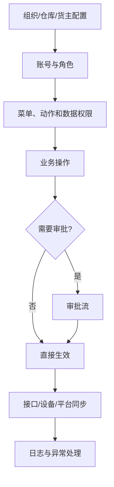
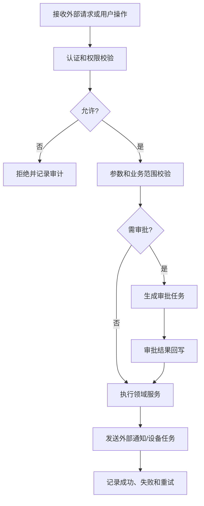
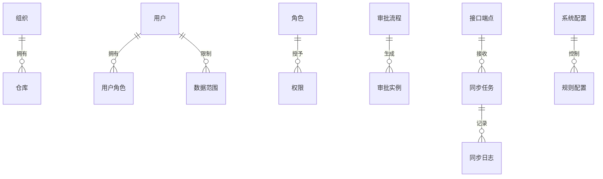

# 12 系统配置、权限与集成设计

## 1. 参考范围

参考 01 章店铺授权、仓库管理、安全设置、审批中心、审批管理、ERP/OMS/WCS/设备对接、接口日志、操作日志、角色和账号管理；02 章商品同步；03 章业务配置；10 章平台电子面单与打印组件；12 章审批、账号和视频运维。

## 2. 模块目标与业务边界

解决 WMS 在多仓、多货主、多平台、多人和多设备环境下如何安全运行、配置生效并与外部系统协同。

包含组织、账号、角色、菜单/动作权限、数据权限、审批、参数配置、接口、授权、异步任务和日志。

不包含具体业务规则的领域实现；本模块只提供配置、控制和集成底座。

## 3. 角色与业务场景

**参考事实**：资料中出现角色管理、账号管理、审批中心、ERP/OMS 对接、设备对接、WCS、店铺授权、电子面单授权、接口日志和操作日志。

**建议设计**：系统管理员维护组织与权限，业务管理员维护仓库规则，审批人处理高风险单据，接口服务负责同步，设备服务负责设备交互。

### 场景说明

| 使用场景 | 触发时机与参与者 | 为什么要用配置/权限/集成 | WMS 解决的问题 | 结果 | 类型 |
|---|---|---|---|---|---|
| 多仓多货主授权 | 3PL 或集团仓库新增组织、仓库或货主 | 同一账号不应看到或操作全部库存 | 以组织、仓库、货主和店铺建立数据范围 | 数据隔离、职责清晰 | 参考事实＋建议设计 |
| 高风险业务审批 | 库存调整、货权转移、规则变更等 | 直接操作可能造成账务或经营风险 | 配置审批条件和审批人，保留审批轨迹 | 业务生效有授权依据 | 参考事实＋建议设计 |
| ERP/OMS 对接 | 接收商品、入库、出库订单并回写 | 手工录入慢且容易重复 | 用接口任务、幂等键、日志和重试承接同步 | 外部与 WMS 状态可对账 | 参考事实＋归纳判断 |
| WCS/设备协同 | 自动化设备接收并回传任务 | 设备请求成功不等于作业完成 | 分离下发、回传、失败和人工接管 | 设备异常可运维 | 参考事实＋建议设计 |
| 电子面单授权 | 平台或承运商需要授权获取面单 | 凭证失效会导致发运中断 | 单独管理授权、面单任务和失败重试 | 面单与包裹链路可追踪 | 参考事实＋建议设计 |
| 配置变更 | 业务切换策略、字段或参数 | 直接改配置会影响进行中业务 | 记录版本、生效时间和影响范围 | 变更可审计、可回看 | 建议设计＋待确认 |

## 4. 业务流程图

## 5. 系统流程图

## 6. 实体对象与单据

## 7. 单据状态与操作矩阵

角色、审批、接口日志、店铺授权和设备对接属于参考事实；统一的授权状态、同步状态和配置状态属于建议设计。

| 对象 | 状态 | 可执行操作 | 操作前提 | 结果 |
|---|---|---|---|---|
| 账号/角色 | 启用、停用 | 新增、修改、停用 | 管理权限 | 影响后续登录和操作 |
| 审批实例 | 审批中、通过、拒绝、撤销（参考事实/建议结合） | 审批、撤回、查看 | 命中审批流程 | 回写业务单据 |
| 接口任务 | 待发送、成功、失败、重试中（建议） | 重试、查看、关闭 | 接口配置有效 | 更新外部同步结果 |
| 系统配置 | 生效、停用（建议） | 修改、启停、查看影响 | 权限和版本校验 | 影响新业务或指定范围 |
| 授权关系 | 未授权、已授权、失效（建议） | 授权、刷新、撤销 | 平台凭证有效 | 允许平台/面单操作 |

### 对象、单据与数量关系

本模块的“关系”主要是控制和同步关系，不应把接口任务成功直接等同于业务单据完成，更不能直接等同库存生效。

| 上游对象 | 下游对象 | 可能关系 | 关系说明 | 类型 |
|---|---|---:|---|---|
| 组织 | 仓库 | 1:N | 一个组织可管理多个仓库，仓库是库存和作业权限的重要边界 | 参考事实＋建议设计 |
| 用户 | 角色 | N:M | 用户可有多个角色，角色聚合菜单、动作和数据权限 | 参考事实＋建议设计 |
| 审批流程 | 审批实例 | 1:N | 一个流程模板可在不同业务单据上生成多次审批实例 | 参考事实＋建议设计 |
| 业务单据 | 审批实例 | 0:N | 只有命中审批条件才生成，撤回/驳回也要保留实例 | 建议设计＋待确认 |
| 外部请求 | 同步任务 | 1:N | 原请求可能因分批、重试或补偿形成多条任务记录，但业务幂等键不变 | 建议设计 |
| 同步任务 | 同步日志 | 1:N | 发送、响应、失败和重试均保留日志 | 参考事实＋建议设计 |
| 业务单据 | 库存流水 | 0:N | 集成模块只负责传输，库存流水由入库、出库或库存模块生成 | 归纳判断 |
| 系统配置 | 配置版本 | 1:N | 配置修改建议形成版本，生效范围和时间可追溯 | 建议设计＋待确认 |

### 状态动作补充矩阵

| 单据/对象 | 当前状态/动作 | 操作前提 | 操作后的状态 | 是否生成任务、流水或关联对象 | 是否允许取消、撤销或反向处理 |
|---|---|---|---|---|---|
| 账号/角色 | 停用 | 管理权限有效，影响范围已确认 | 停用 | 生成操作日志，不生成库存流水 | 可启用；历史单据和日志不撤销 |
| 审批实例 | 通过/拒绝 | 当前节点权限和意见完整 | 通过/拒绝 | 回写业务单据，是否生成领域任务由领域模块决定 | 审批中可撤回；通过后反向按领域单据处理 |
| 同步任务 | 发送/重试 | 端点、授权和幂等键有效 | 成功/失败/重试中 | 生成同步日志；业务单据和库存结果由领域模块决定 | 可关闭失败任务；不得删除调用记录 |
| 系统配置 | 发布新版本 | 参数校验和生效范围明确 | 生效/待生效 | 生成配置版本和审计日志，不生成库存流水 | 未生效可撤销；生效后用新版本替代 |
| 授权关系 | 刷新/撤销 | 凭证或平台权限有效 | 已授权/失效 | 生成授权和接口日志，可影响面单/同步任务 | 可重新授权；已创建业务对象按补偿流程处理 |

## 8. 库存影响

通常无直接库存影响。配置会间接决定库存是否能够被入库、分配、冻结、调整和同步。

库存初始化、库存调整和库存同步属于业务交易，必须由库存模块产生库存流水；系统配置不能直接修改库存余额。

## 9. 异常与逆向流程

适用：

- 账号停用不得删除操作日志和历史单据。
- 权限撤销立即阻止新操作，但已提交任务是否继续，按领域规则处理。
- 接口失败必须保存请求、响应、错误原因和重试次数；不能把失败记为成功。
- 配置变更应记录变更前后值、生效时间、操作者和影响范围。
- 授权失效时，已创建的订单、面单和任务如何处理需有补偿流程。

## 10. 字段与业务逻辑

本节权限三层模型、接口幂等、配置版本和审计字段属于建议设计；账号、角色、仓库、货主、审批、接口、请求号、错误码和操作日志来自参考事实。

核心字段：组织、仓库、货主、用户、角色、权限、数据范围、配置编码、配置值、版本、生效时间、审批流程、接口编码、平台授权、任务号、请求号、响应号、错误码和操作日志。

建议权限分三层：菜单可见、动作可执行、数据可见。敏感字段另加脱敏和查看权限，不用菜单权限替代字段安全。

接口逻辑：外部单号或请求号幂等；同步状态与业务状态分离；失败可重试；重试不得重复创建单据或库存流水。

### 表头字段

| 字段名称 | 字段含义 | 来源/写入时机 | 必填性 | 可修改时点 | 查询/展示/导出 | 校验与下游影响 | 类型 |
|---|---|---|---|---|---|---|---|
| 组织/仓库/货主 | 权限和业务数据边界 | 配置或业务单据关联 | 按场景必填 | 生效前可改，生效后受限 | 权限、单据、库存 | 决定数据可见和可操作范围 | 参考事实＋建议设计 |
| 用户/角色/权限 | 操作者身份和授权 | 管理员维护 | 用户必填 | 账号停用或角色调整 | 权限、审计 | 菜单、动作、数据范围分层校验 | 参考事实＋建议设计 |
| 配置编码/版本/生效时间 | 参数身份和生效控制 | 配置发布时生成 | 必填 | 新版本修改 | 配置、审计 | 已创建单据是否追溯生效需确认 | 建议设计＋待确认 |
| 审批流程/审批状态 | 高风险业务的授权流程 | 单据命中条件时生成 | 按业务必填 | 审批中不可绕过 | 单据、审批中心 | 通过前是否允许库存生效由领域模块定义 | 参考事实＋建议设计 |
| 接口编码/授权关系 | 外部系统和凭证身份 | 集成配置 | 对接场景必填 | 运行中修改需审计 | 接口、授权 | 凭证失效影响同步和面单操作 | 参考事实＋建议设计 |
| 同步状态/错误信息 | 传输结果，不等于业务状态 | 请求发送后更新 | 系统生成 | 通过重试改变并保留历史 | 接口日志、业务单据 | 失败必须可补偿，不得假成功 | 建议设计 |

### 明细与日志字段

| 字段名称 | 字段含义 | 来源/写入时机 | 必填性 | 可修改时点 | 查询/展示/导出 | 校验与下游影响 | 类型 |
|---|---|---|---|---|---|---|---|
| 菜单/动作权限 | 能否看见和执行功能 | 角色授权 | 按权限模型必填 | 生效后新增版本或记录 | 权限审计 | 动作权限不能替代数据权限 | 建议设计 |
| 数据范围明细 | 可查看的仓库、货主、店铺或区域 | 角色/用户配置 | 按角色必填 | 变更需记录 | 权限详情 | 所有查询和导出都必须过滤 | 建议设计 |
| 审批节点/审批意见 | 谁在何时作出什么决定 | 审批操作 | 审批场景必填 | 不可覆盖，只能追加 | 审批轨迹、审计 | 形成生效前授权证据 | 参考事实＋建议设计 |
| 请求号/外部单号/重试次数 | 接口幂等和重试身份 | 外部请求/同步任务 | 对接场景必填 | 不可改 | 接口日志 | 重试不得重复创建业务对象 | 建议设计 |
| 请求/响应摘要/错误码 | 接口事实和失败原因 | 每次调用记录 | 失败时错误必填 | 不可改 | 接口日志 | 敏感数据需脱敏，支持补偿判断 | 建议设计 |
| 操作前值/操作后值/操作者 | 配置、权限和业务操作审计 | 变更提交时生成 | 审计场景必填 | 不可改 | 操作日志 | 记录时间、来源终端和原因 | 参考事实＋建议设计 |

## 11. 功能清单

| 优先级 | 功能 | 目标与上下游影响 |
|---|---|---|
| P0 | 账号、角色、仓库/货主数据权限 | 保证系统安全 |
| P0 | 操作日志、接口日志和失败重试 | 保证可审计和可运维 |
| P0 | 基础配置和审批框架 | 控制高风险业务 |
| P0 | ERP/OMS 基础集成 | 接收订单和回写结果 |
| P1 | WCS、设备、电子面单和平台授权 | 支撑自动化和电商履约 |
| P1 | 配置版本和影响分析 | 降低配置变更风险 |
| 后续 | 多租户配置中心、事件总线和可视化编排 | 在规模化后建设 |

### 功能说明与首版取舍

| 优先级 | 功能 | 使用场景 | 解决的问题 | 核心交互/规则 | 生成或影响对象 | 我们的补充说明 |
|---|---|---|---|---|---|---|
| P0 | 账号、角色和数据权限 | 多仓、多货主、多人作业 | 越权查看或误操作 | 菜单、动作、数据范围三层授权 | 用户、角色、权限、日志 | 首版先保证仓库/货主隔离 |
| P0 | 审批框架 | 调整、货权、规则等高风险操作 | 关键变更没有授权证据 | 命中条件—审批—回写生效，意见不可覆盖 | 审批实例、业务单据 | 哪些单据审批由领域模块配置 |
| P0 | 接口接收与回写 | ERP/OMS 商品、入库、出库同步 | 手工录入、重复创建、失败不透明 | 幂等、校验、异步任务、日志和重试 | 同步任务、业务单据、库存流水 | 集成层不直接决定库存生效 |
| P0 | 操作/接口审计 | 业务投诉、同步失败和安全审计 | 无法解释谁改了什么 | 追加式日志，记录前后值、请求和结果 | 操作日志、接口日志 | 敏感数据需要脱敏 |
| P0 | 基础配置中心 | 仓库规则、作业开关和业务参数 | 参数散落、改动无边界 | 配置项有说明、类型、范围、生效时间和版本 | 配置版本、策略 | 不把隐藏开关当产品能力 |
| P1 | WCS/设备/打印授权 | 自动化设备或电子面单 | 设备和平台凭证失效影响作业 | 授权、下发、回传、失败、人工接管 | 设备任务、面单任务、同步日志 | 厂商协议保持适配器边界 |
| P1 | 失败补偿与对账 | 接口成功但业务未回写 | 外部和 WMS 状态长期不一致 | 失败队列、重试、人工补偿和对账 | 同步任务、业务单据 | 不允许直接把失败改成成功 |
| 后续 | 事件总线/配置编排/多租户中心 | 规模化产品化输出 | 集成和配置复杂度上升 | 统一事件、租户隔离和编排 | 事件、配置、租户 | 先完成核心交易闭环再建设 |

## 12. 万里牛设计借鉴判断

### 判断标准

| 维度 | 判断问题 |
|---|---|
| 通用性 | 权限、审批、接口和配置是否能服务多仓、多货主和多系统？ |
| 业务价值 | 是否降低越权、重复同步、配置误改和运维成本？ |
| 闭环完整性 | 是否覆盖认证、授权、审批、执行、回写、失败和审计？ |
| 实现成本 | 首版是否优先做稳定的权限、日志、幂等和补偿？ |
| 边界风险 | 是否把平台授权、厂商协议和隐藏开关误当通用 WMS 能力？ |

集成设计的借鉴重点是“业务状态与同步状态分离、失败可恢复、操作可审计”，不是接口数量越多越好。

### 详细借鉴判断

| 参考设计表现 | 可复用原因 | 我们的改造 | 不能照搬的边界 | 结论/类型 |
|---|---|---|---|---|
| 角色、账号、店铺授权和仓库管理分开出现 | 权限、业务对象和平台授权责任不同 | 统一菜单、动作、数据范围三层模型 | 不照搬某平台的授权层级和页面名称 | 建议改造后借鉴；参考事实＋建议设计 |
| 有审批中心和审批管理 | 高风险库存/配置操作需要授权依据 | 审批流程模板与业务单据解耦，结果回写 | 不把资料中出现的审批页面当成所有单据都审批 | 建议直接借鉴并补充；参考事实＋待确认 |
| ERP/OMS/WCS/设备、接口日志分开 | 外部系统的职责和失败模式不同 | 统一同步任务和适配器，业务状态与同步状态分离 | 不绑定特定厂商协议和平台字段 | 建议直接借鉴并改造；参考事实＋建议设计 |
| 操作日志和接口日志可追溯 | 运维和审计需要不同证据 | 记录前后值、请求响应、错误和重试 | 不记录敏感凭证明文 | 建议直接借鉴；参考事实＋建议设计 |
| 大量业务配置和开关 | SaaS 产品需要适配不同现场 | 配置项增加说明、范围、版本、试算和影响分析 | 不照搬隐藏开关，未确认行为不写成默认规则 | 建议改造后借鉴；参考事实＋边界判断 |

| 判断 | 内容 |
|---|---|
| 建议直接借鉴 | 业务配置、审批中心、接口日志、操作日志、平台授权和设备对接分开管理 |
| 建议改造后借鉴 | 将大量业务开关整理为有名称、有说明、有生效范围和有版本的配置项 |
| 不建议照搬 | 隐藏后台开关、平台授权流程、特定厂商组件和固定接口字段 |
| 我们需要补充 | 统一权限模型、幂等键、失败补偿、配置版本和审计策略 |
| 资料不足，待确认 | 审批适用单据范围、配置即时生效范围和接口重试上限 |

## 13. 跨模块依赖与待确认问题

1. 组织、仓库、货主和店铺的数据权限层级。
2. 哪些单据需要审批，审批通过后是否才允许库存生效。
3. 接口失败时业务单据保持原状态还是进入同步异常状态。
4. 配置变更对已创建订单、任务和库存是否追溯生效。
5. 是否需要支持多租户、外部客户自助查询和货主隔离。
