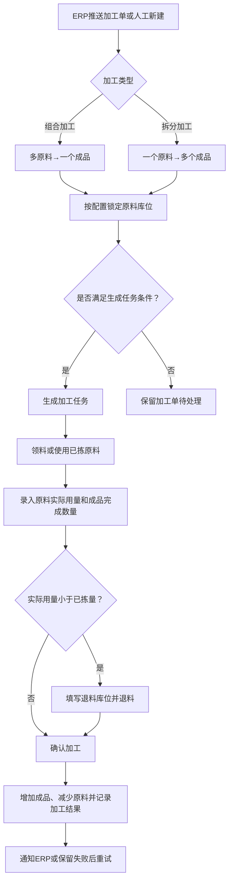

# 13 仓内加工与作业结果设计

## 1. 参考范围

本模块直接参考：

- `00-源文件/操作手册/仓内作业/加工/仓内加工.md`
- `00-源文件/操作手册/仓内作业/加工/加工任务.md`
- `00-源文件/PDA安卓端/仓内/PDA-快速加工.md`
- `00-源文件/PDA安卓端/仓内/PDA-加工领料.md`
- 01层：[07-仓内作业](../01-按章节拆分的md文件/07-仓内作业.md)
- 04层：[09-库存交易与盘点字段设计](../04-WMS的字段设计参考借鉴/09-库存交易与盘点字段设计.md)、[10-任务管理字段设计](../04-WMS的字段设计参考借鉴/10-任务管理字段设计.md)

本文件补充的是03层设计抽象，不表示所有通用WMS都必须建设加工模块，也不把加工等同于制造系统的BOM/MRP。

## 2. 模块目标与边界

仓内加工解决“已有库存经过仓内组合或拆分后，形成另一种可销售或可作业商品”的问题。原文明确支持组合加工和拆分加工，也支持手动生成加工任务、ERP带任务号自动生成任务、原料领料、加工完成和退料。

不包含生产计划、工艺路线、物料需求计划和成本核算。当前资料只足以支持仓内加工单、原料/成品配比、库存锁定、任务执行和结果回传。

## 3. 从原文提炼的业务事实

| 原文事实 | 对产品设计的启发 | 边界 |
|---|---|---|
| 一个加工单可以是多个原料组合成一个成品 | 原料行和成品行要分开，不能把加工单当普通库存移动单 | 原文明确“目前一个加工单只有一个成品”，不推导多成品 |
| 加工前会锁定原料库位，待加工状态还可能有已拣原料 | 加工单状态、原料锁定和实际领料是三个不同层次 | 锁定的具体数量口径由配置和场景决定 |
| 原料实际用量可以小于已拣数量，差额要退料 | 加工确认必须能录入实际用量，并在需要时强制填写退料库位 | 退料的审批和费用规则原文未统一说明 |
| 成品实际生成数量可以小于或大于计划数量 | 成品计划量不能当作硬性上限，确认时必须保留计划/实际差异 | 是否允许差异直接生效或需要审批，待确认 |
| 生产批次严格模式下，原料按批次锁定，成品批次可能取原料最早过期批次 | 批次字段要在加工单、锁定明细和结果库存之间传递 | 只适用于源文档描述的生产批次模式 |
| 外部ERP关闭加工单时，系统可能提示退料 | 取消和关闭不是简单改状态，要先处理已拣原料 | 外部关闭与WMS关闭的完整状态映射待确认 |

## 4. 业务流程图

## 5. 对象、状态与数量关系

### 5.1 对象关系

| 对象 | 职责 | 关键关系 |
|---|---|---|
| 加工单 | 表达一次加工意图和配比 | 一个加工单包含原料行和成品行 |
| 加工单明细 | 表达原料/成品、计划数量和配比 | 原料与成品分属不同明细角色 |
| 原料锁定明细 | 表达从哪些库位锁定多少原料 | 一个原料行可能对应多个库位 |
| 加工任务 | 组织多个加工单一起作业 | 一个任务可以包含多个加工单，但要满足同货主、类型和状态等条件 |
| 退料记录 | 表达已拣但未实际使用的原料退回 | 退料数量大于0时，原文要求退料库位必填 |
| 加工库存流水 | 表达原料减少、成品增加、退料回库 | 具体流水拆分方式需结合库存模型确认 |

### 5.2 状态与动作

| 状态/动作 | 原文事实 | 设计时要单独保留 |
|---|---|---|
| 待领料 | 原料未完成领料，允许按条件加工或生成任务 | 计划量、锁定量、已拣量 |
| 待加工 | 原料已部分或全部领料 | 已拣量、可用实际量、待退料量 |
| 确认加工 | 填写实际原料和成品数量后完成 | 实际用量、完成量、加工员、完成时间 |
| 撤销/关闭 | 已领取或已完成任务不能直接撤销；待加工撤销时可能先退料 | 原任务、退料结果、关闭原因 |
| 通知ERP失败 | 加工单状态不变，可重新加工 | 外部状态、通知结果、重试记录 |

## 6. 设计要点

1. 加工单不是“库存直接改数量”的快捷入口。至少要把加工意图、原料锁定、现场实际消耗、退料和成品结果分开。
2. 组合加工和拆分加工可以共用任务生命周期，但原料/成品方向、配比计算和结果校验不能共用一套隐含规则。
3. 批量确认加工只适用于资料明确的条件，例如待领料且锁库成功、待加工且全部领料；部分领料不能为了批量效率而跳过退料判断。
4. 原料和成品包含生产批次时，要把批次匹配规则写成场景规则，不要默认所有加工都自动继承批次。
5. PDA快速加工、PC仓内加工和加工任务都应回到同一个加工结果模型，入口可以不同，库存和追溯结果不能各自一套。

## 7. 首版取舍

| 优先级 | 能力 | 取舍判断 |
|---|---|---|
| P0 | 组合/拆分加工单、原料/成品明细、计划/实际数量 | 原文核心闭环，适合先落地 |
| P0 | 原料锁定、加工任务、确认加工、退料 | 直接影响库存准确性和现场责任 |
| P1 | PDA快速加工、批量确认、ERP任务号接收 | 提升效率，但依赖任务和接口基础 |
| P1 | 生产批次严格模式 | 有批次业务时采用，不作为所有仓库默认前提 |
| 后续 | 复杂工艺、成本、配方版本、产能排程 | 当前资料不足，也容易把WMS扩成制造系统 |

## 8. 给新手产品经理的验收问题

- 一个加工单是否只能有一个成品？如果要多成品，是否另建模型？
- 原料锁定发生在加工单创建、任务生成还是领料前？
- 原料已拣但未使用时，退料是否必须经过独立确认？
- 成品实际数量大于计划量时，谁能确认，是否需要审批？
- 原料减少、成品增加和退料回库分别在哪个动作生效？
- ERP关闭加工单时，WMS如何识别已拣原料并避免库存悬挂？
