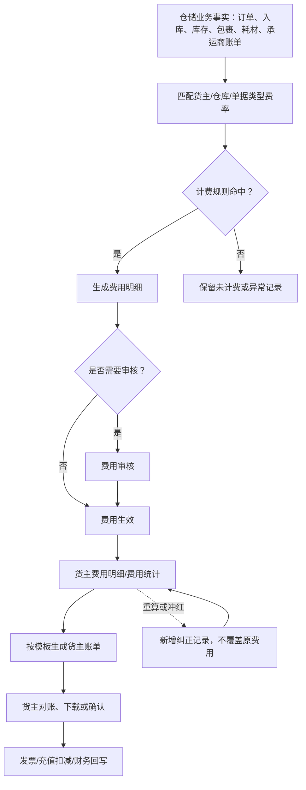

# 14 3PL费用、货主协同与结算设计

## 1. 参考范围

本模块直接参考：

- `00-源文件/操作手册/财务/费用统计/货主费率配置.md`
- `00-源文件/操作手册/财务/费用统计/货主增值费用.md`
- `00-源文件/操作手册/财务/费用统计/货主费用明细.md`
- `00-源文件/操作手册/财务/费用统计/货主费用统计.md`
- `00-源文件/操作手册/财务/费用统计/货主账单.md`
- `00-源文件/操作手册/财务/对账/承运商对账.md`
- `00-源文件/操作手册/财务/发票/发票配置.md`、`发票打印.md`
- 01层：[11-客服与财务](../01-按章节拆分的md文件/11-客服与财务.md)
- 04层：[19-3PL费用与货主结算字段设计](../04-WMS的字段设计参考借鉴/19-3PL费用与货主结算字段设计.md)

货主费用功能在原文中明确只对开启3PL的公司开放，不能把它写成所有仓库的默认WMS核心。

## 2. 为什么这是独立设计模块

仓储服务商向货主收费时，出库操作费、出库运费、入库费用、存储费用和增值费用的来源不同、出账时点不同、审核和冲红方式也不同。它不是“报表多几个金额列”，而是从业务事实生成费用，再经过审核、对账、账单和发票的服务结算链。

## 3. 原文事实与设计启发

| 原文事实 | 设计启发 | 边界 |
|---|---|---|
| 货主费率按仓库、货主、单据类型等维度配置，一个货主+费用分类+仓库只能启用一种规则 | 费率规则需要明确作用域和有效版本 | “取最高/取最低”的完整冲突规则只适用于原文对应费率场景 |
| 出库费用可按单、商品数量、商品种类、订单重量、订单体积、重量段或拣货库存形态计费 | 计费规则必须保存计费维度、区间、首计和续计参数 | 具体区间边界和四舍五入不能自行统一 |
| 存储费用可按商品日库存、体积、重量、周转天数、日使用库位或日固定费用计费 | 存储费需要统计日、计费范围和库存口径 | 存储费用无关联单据，不能强行要求单据号 |
| 增值费用支持自定义费用类型，关联单据可为出库、入库、盘点、加工、移库 | 增值费是独立费用明细，既可按单新增也可导入 | 导入时不与单据强关联的行为不能泛化为所有费用 |
| 货主账单可按月或选定时间汇总，可导出汇总单或明细单，可按包裹生成 | 账单模板和账单实例要分开，导出字段顺序属于模板配置 | 对账后不能删除，具体账单状态需按业务确认 |
| 增值费用审核后进入费用明细和统计，计费单价与产生费用可为负数用于冲正 | 审核、冲红和重算必须保留原记录，不直接覆盖历史金额 | 负数能否出现在其他费用类型，原文未统一说明 |

## 4. 费用结算主链

## 5. 结算对象与状态

| 对象 | 主要职责 | 建议状态/动作 | 结果 |
|---|---|---|---|
| 费率规则 | 定义某货主在某仓库和业务类型下如何收费 | 草稿、启用、停用、版本切换 | 后续费用计算引用规则快照 |
| 费用明细 | 保存一条可解释的费用事实 | 待审核、已生效、冲红/纠正 | 进入统计和账单 |
| 承运商对账任务 | 将承运商账单与WMS预估成本比较 | 待导入、处理中、完成、失败、可核销 | 更新对账成本或保留差异 |
| 货主账单模板 | 定义账期、明细项、显示顺序和包裹维度 | 启用、停用、修改 | 生成账单时决定导出结构 |
| 货主账单 | 固化某货主某时间范围的结算结果 | 草稿、待对账、已对账、下载 | 对账后保留，不直接删除 |
| 发票 | 表达已结算费用的开票结果 | 待开、已开、作废等状态待确认 | 与账单和费用明细关联 |

## 6. 产品设计要点

1. 先定义“费用从哪个业务事实产生”，再设计费率。出库费用、运费、存储费和增值费不能共用一个模糊的`amount`字段。
2. 计费规则必须可试算、可解释、可重算。原文已有运费模拟试算入口，产品上应让用户看到命中的规则、计费数量、单价和结果。
3. “费用创建时间”“业务完成时间”“账期时间”“开票时间”要分开，不能用一个日期同时承载统计和财务口径。
4. 冲红不是把原费用改成负数后覆盖原记录，而是新增一条可关联原费用的纠正记录；原文允许负数，但历史证据仍应保留。
5. 货主账单模板、账单实例和费用明细是三个层次。模板修改是否影响已生成账单，原文明确会影响对应账单下载，设计时必须把这项影响提示出来。

## 7. 首版取舍

| 优先级 | 能力 | 取舍判断 |
|---|---|---|
| P0/条件 | 费用明细、货主/仓库/单据类型范围、出库/入库/存储基础计费 | 只对3PL场景启用，先保证可解释 |
| P1 | 增值费用、费用审核、重算、冲红 | 服务型仓库常用，必须有审计和反向记录 |
| P1 | 货主账单模板、账单下载、对账 | 把内部费用变成货主可核对的交付物 |
| P1 | 承运商对账与预估成本重算 | 连接物流成本和结算结果 |
| 后续 | 复杂合同价、阶梯价自动优化、税务全流程 | 当前资料不足，需结合财务系统边界确认 |

## 8. 给新手产品经理的验收问题

- 一条费用明细能否回答“为哪个货主、哪个仓库、哪类业务、按什么数量、什么单价算出”？
- 存储费用没有单据时，账单如何提供足够的库存日期和统计范围证据？
- 费率规则变更后，历史费用按旧规则保留还是允许重算？
- 费用审核失败、账单对账失败和发票作废分别由谁处理？
- 承运商对账成本与货主运费是否是同一个金额，还是两个不同结算口径？
