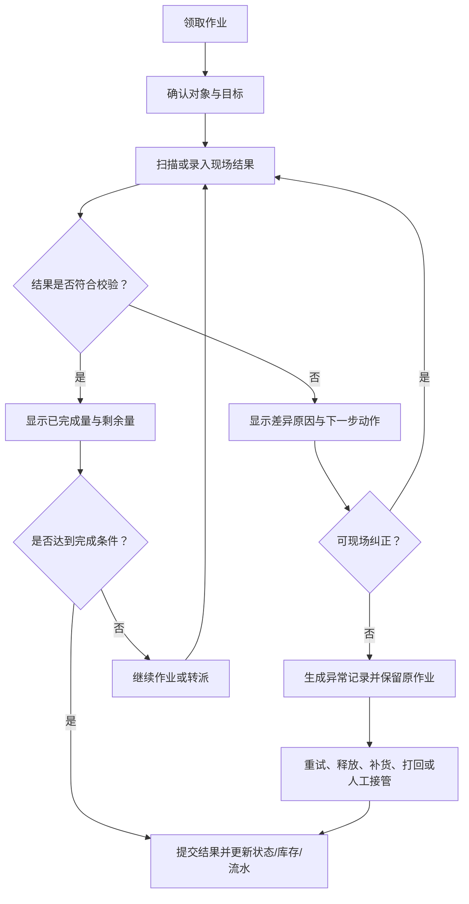

# 15 仓内作业体验与异常反馈设计

## 1. 参考范围

本模块参考收货扫描匹配、波次与拣货报缺、补货上架、盘点、打印服务和接口回传等原始内容，重点不是增加菜单，而是把现场动作设计成“看得懂、做得完、出错后能恢复”的作业体验。

参考入口：

- `00-源文件/操作手册/入库/快速入库/收货入库.md`
- `00-源文件/操作手册/仓内策略/波次策略/普通波次/index.md`
- `00-源文件/操作手册/仓内作业/库存移动/补货上架.md`
- `00-源文件/操作手册/仓内作业/库存变更/盘点任务.md`
- `00-源文件/专题功能介绍/打印_电子面单/WMS-万里牛打印服务助手.md`
- `00-源文件/操作手册/设置/异步接口日志.md`

## 2. 体验问题的根因

仓内作业不是普通表单录入。现场人员通常在移动、扫描、多人协作和时间压力下工作，最容易翻车的不是没有按钮，而是系统没有把“当前对象、应做数量、已做数量、差异原因和下一步动作”同时讲清楚。

| 现场问题 | 只做功能的表现 | 应补的体验 |
|---|---|---|
| 扫描不匹配 | 只提示“商品错误” | 告知期望商品、实际扫描结果、是否允许换行或重新扫描 |
| 拣货报缺 | 把应拣数量改小 | 保留应拣、已拣、缺货和剩余，并给出重锁、补货或打回路径 |
| 规则未命中 | 订单停在列表里 | 展示未命中原因、当前策略版本和可执行的人工处理 |
| 补货积压 | 只显示待补货数量 | 显示来源库位、目标库位、锁定量、待补量和优先级 |
| 打印/接口失败 | 页面提示失败后结束 | 保留失败对象、错误原因、重试、作废或人工接管入口 |
| 盘点有差异 | 只显示一个差异数字 | 把盘前量、实盘量、差异量、复盘/调整责任链展示出来 |

## 3. 作业体验主链

这张图是通用设计建议，不代表原文所有页面都有统一的反馈机制。原文中已经出现的“多匹配弹窗”“报缺重锁”“自动补货”“打印失败处理”等能力，可以作为具体场景的事实依据；统一的“下一步动作”是建议设计。

## 4. 体验设计原则

1. **先告诉现场对象，再告诉错误**：商品、库位、容器、订单或任务号必须在反馈中可见，不能让操作员靠返回列表找上下文。
2. **数量永远成组出现**：应作、已作、差异、剩余和生效结果不能只显示一个当前值。
3. **错误反馈必须带动作**：错误原因后面至少给出重新扫描、选择匹配项、补货、报缺、释放、重试、作废或转人工中的适用动作。
4. **自动处理必须可解释**：波次、上架、补货和费用规则命中时，显示命中规则或未命中原因；不把自动化做成黑箱。
5. **提交前后边界清晰**：页面要明确“只是录入”“已提交任务”“已改变库存”“已通知外部系统”分别发生在哪一步。
6. **失败不能抹掉现场事实**：打印、接口和设备失败可以重试，但不能用新结果覆盖旧错误；要能看到原对象、失败时间、次数和最后结果。
7. **异常处理与正常处理同一入口可回到主链**：报缺、部分上架、退料和差异调整最终都要回到可继续、可关闭或可追溯的状态。

## 5. 首版建议

| 优先级 | 能力 | 适用场景 |
|---|---|---|
| P0 | 当前对象、目标数量、已完成量、剩余量 | 收货、拣货、上架、盘点、加工 |
| P0 | 错误原因和下一步动作 | 扫码不匹配、数量超限、库位不可用 |
| P0 | 异常记录、操作人、时间和原任务关联 | 报缺、差异、关闭、打印/接口失败 |
| P1 | 规则命中解释和未命中队列 | 波次、上架、补货、承运商匹配 |
| P1 | 重试、释放、作废、转派和人工接管 | 设备、打印、接口和多人协作 |
| 后续 | 个性化作业顺序、智能推荐和预测提醒 | 需要真实现场数据验证后再做 |

## 6. 给新手产品经理的验收问题

- 操作员不看上一页，当前页面能否知道自己正在处理哪个对象？
- 扫描错误时，系统是否告诉他“为什么错”和“下一步能做什么”？
- 部分完成后，剩余数量是否仍然可见、可继续、可关闭且有原因？
- 自动规则没有命中时，是否存在明确的人工处理队列？
- 重试成功后，历史失败是否仍可查，是否会重复扣减或重复回传？
- 主管能否从异常看板直接跳到任务、库存流水或原始业务单据？
