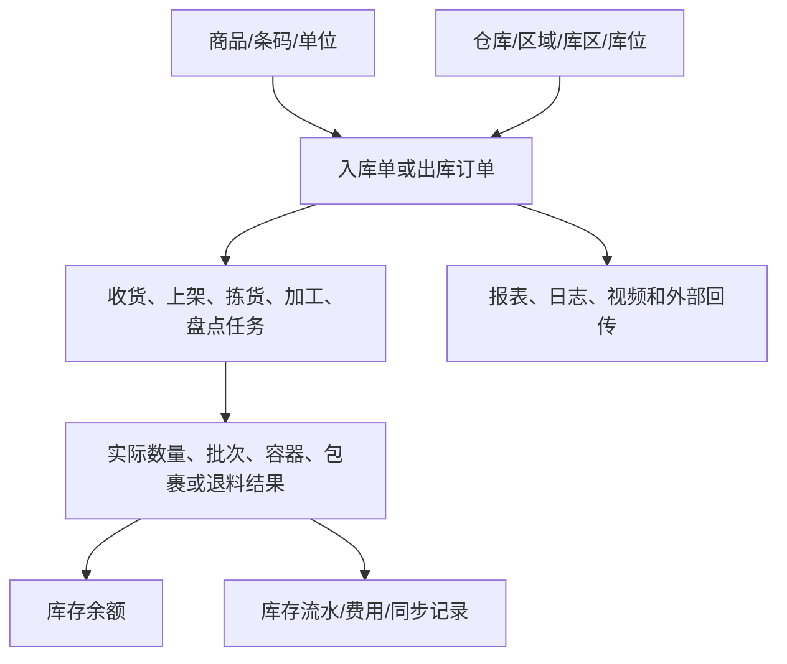

# 20 原始字段观察与设计验收

本文件解决一个常见误区：操作手册里的页面字段、提示文字和计算公式，不能直接等同于数据库字段；但如果完全不保留原始观察点，建议字段又会变成脱离事实的想象。

## 1. 四层字段证据

| 层级 | 例子 | 可以做什么 | 不能做什么 |
|---|---|---|---|
| 原始页面/原文词汇 | 实际库存、可用库存、锁定库存、收货库位、退料库位、费用类型 | 记录产品上应该出现和被解释的业务概念 | 不直接声称这是数据库字段名 |
| 原文计算/校验 | `可用库存=实际库存-锁定数量-冻结数量` | 形成数量口径和验收规则 | 不把局部页面公式泛化到所有场景 |
| 建议逻辑字段 | `available_qty`、`return_location_id`、`fee_amount` | 用于PRD、数据模型和接口讨论 | 必须标记为建议编码 |
| 待确认设计 | 库存生效时点、状态映射、规则版本 | 形成评审问题 | 不写成已实现事实 |

## 2. 原始观察→建议字段对照表

| 业务域 | 原始文件/原文观察 | 建议字段或对象 | 下游用途 | 验收问题 |
|---|---|---|---|---|
| 空间 | [仓库库位](../00-源文件/操作手册/基础信息/档案管理/仓库库位.md)：区域、库区、库位；库位使用方式；库位标签；货品混放；容积、承重；优先商品；排除指导余量/历史 | `warehouse_id`、`area_id`、`zone_id`、`location_id`、`location_usage_type`、`location_tag`、`mix_allowed`、`capacity`、`weight_limit` | 上架、拣货、补货、库存查询、策略匹配 | 库位改用途时，订单锁定、任务在途和库存如何校验？ |
| 商品 | [商品信息](../00-源文件/操作手册/商品信息/基础档案/商品信息.md)：商品编码、规格、条码、行业配置、存储条件、序列号前缀；[计量单位管理](../00-源文件/操作手册/商品信息/基础档案/计量单位管理.md) | `product_id`、`product_code`、`barcode`、`specification`、`storage_condition`、`serial_rule`、`base_unit_code` | 收货、拣货、验货、盘点、箱规换算 | 同条码匹配多个商品时按什么范围选择？ |
| 箱规/多单位 | [商品多级单位](../00-源文件/专题功能介绍/行业_库存属性/装箱_箱规_多单位/WMS-商品多级单位管理.md)：单位比值、多单位条码、推荐单位；`00-源文件/专题功能介绍/行业_库存属性/装箱_箱规_多单位/WMS-箱规模块(箱规).md`：箱拣选库位、箱码、比值 | `unit_code`、`conversion_rate`、`unit_barcode`、`pack_spec_id`、`case_barcode` | 按箱收货、箱拣、箱规盘点、辅助单位录入 | 修改箱规后，已有货箱库存和历史单据是否受影响？ |
| 批次/效期/次品 | [保质期禁收禁售](../00-源文件/专题功能介绍/行业_库存属性/WMS-保质期禁收_禁售.md)、[生产批次标准模式](../00-源文件/专题功能介绍/行业_库存属性/WMS-生产批次标准模式.md)、[残次品](../00-源文件/专题功能介绍/行业_库存属性/WMS-残次品.md) | `lot_no`、`production_date`、`expiry_date`、`inventory_attr`、`reject_reason` | 入库校验、批次分配、库存隔离、追溯 | “禁收”与“禁售”分别作用于哪个动作和哪个数量？ |
| 入库 | [收货入库](../00-源文件/操作手册/入库/快速入库/收货入库.md)：运单号/外部单号匹配、商品条码匹配、收货库位、容器、次品；[分批入库任务](../00-源文件/操作手册/入库/分批入库/进度/分批入库任务.md)：清点、质检、确认入库、取消入库 | `inbound_notice_no`、`external_no`、`received_qty`、`receiving_location_id`、`container_id`、`qc_result`、`effective_at` | 入库进度、库存生效、上架、ERP回传 | 收货、确认入库和上架是否分别产生记录？ |
| 出库订单 | [订单审核](../00-源文件/操作手册/出库_B2C/打单/订单审核.md)、[待分配](../00-源文件/操作手册/出库_B2C/打单/待分配.md)、[预出库订单](../00-源文件/操作手册/出库_B2C/打单/预出库订单.md)：订单状态、承运商、店铺、优先级、缺货、前置发货、拆单 | `external_order_no`、`order_type`、`store_id`、`carrier_id`、`priority`、`status`、`shortage_reason`、`split_parent_id` | 波次、分配、拣货、包裹、回传 | 订单改单、拦截、取消发生在打印、拣货、出库哪个节点？ |
| 出库执行 | [拣货任务](../00-源文件/操作手册/出库_B2C/拣货/拣货任务.md)、[条码验货](../00-源文件/操作手册/出库_B2C/验货/条码验货.md)、[称重复核](../00-源文件/操作手册/出库_B2C/称重/称重复核.md) | `wave_id`、`task_id`、`source_location_id`、`picked_qty`、`verified_qty`、`package_id`、`weight`、`waybill_no` | 任务进度、复核、包装、出库、承运商交接 | 拣货、验货、称重和出库的生效时点是否一致？ |
| 库存 | [库存总量](../00-源文件/操作手册/库存/库存状况/库存总量.md)：实际、可用、锁定、冻结、在途、详情、记账时间；[库位库存](../00-源文件/操作手册/库存/库存状况/库位库存.md)：库位、容器、作业中商品 | `actual_qty`、`available_qty`、`locked_qty`、`frozen_qty`、`in_transit_qty`、`accounting_at`、`container_id` | 分配、查询、预警、对账、流水 | 作业中商品是否独立余额，还是库存详情的查询结果？ |
| 补货/盘点 | [补货上架](../00-源文件/操作手册/仓内作业/库存移动/补货上架.md)：预警上下限、待补货任务、来源/目标库位、自动完结；[盘点任务](../00-源文件/操作手册/仓内作业/库存变更/盘点任务.md)：盘前量、实盘量、差异量、明盘/盲盘 | `replenishment_task_id`、`min_qty`、`max_qty`、`source_location_id`、`target_location_id`、`system_qty`、`counted_qty`、`difference_qty` | 库区补货、库存调整、绩效和异常 | 补货任务强制完成后，未补数量如何回到需求或预警？ |
| 加工 | [仓内加工](../00-源文件/操作手册/仓内作业/加工/仓内加工.md)：原料、成品、配比、实际用量、退料库位、生产批次；[加工任务](../00-源文件/操作手册/仓内作业/加工/加工任务.md)：待领料、待加工、任务撤销、退料 | `process_order_no`、`line_role`、`ratio_qty`、`actual_qty`、`return_qty`、`return_location_id`、`task_status` | 原料锁定、成品库存、退料流水、ERP通知 | 成品实际数量超计划时是否需要审批？ |
| 3PL费用 | [货主费率配置](../00-源文件/操作手册/财务/费用统计/货主费率配置.md)：费用分类、计费方式、区间、首续计、出账时间；[货主增值费用](../00-源文件/操作手册/财务/费用统计/货主增值费用.md)：费用类型、关联单据、计费单价、产生费用、审核、负数冲正 | `fee_type`、`billing_method`、`billing_qty`、`unit_price`、`fee_amount`、`fee_status`、`original_fee_id` | 费用明细、统计、账单、发票、货主扣减 | 费用金额能否解释到业务单据或存储统计日期？ |
| 账单/对账 | [货主账单](../00-源文件/操作手册/财务/费用统计/货主账单.md)：账期、模板、明细、包裹、对账后不可删除；[承运商对账](../00-源文件/操作手册/财务/对账/承运商对账.md)：导入、任务、结果、核销、预估成本 | `bill_template_id`、`billing_period_from`、`billing_period_to`、`bill_status`、`reconciliation_task_no`、`estimated_cost`、`reconciled_cost` | 货主下载、承运商成本、财务核销 | 货主应收和承运商应付是否分开建模？ |
| 视频追溯 | [视频监控专题](../00-源文件/专题功能介绍/其他/WMS-视频监控专题/index.md)：摄像设备、存储设备、通道号、工位绑定、录制环节、单号放大 | `camera_id`、`storage_server_id`、`channel_no`、`workstation_id`、`recording_started_at`、`business_object_id` | 异常举证、订单/任务回看、运维 | 视频关联是按单号、操作时间还是操作记录建立？ |

## 3. 跨模块字段最小闭环

一个字段设计通过验收，至少要回答四个问题：它记录什么事实、谁在什么时候写入、哪个后续动作读取、发生异常时能否保留原值和原因。

## 4. 设计验收规则

1. 原文页面词汇和建议字段分列，不把`actual_qty`写成万里牛真实字段。
2. 数量字段必须说明单位和阶段，至少区分计划、实际、锁定/分配、作业、差异和生效结果。
3. 状态字段必须能对应动作和结果；如果只是页面筛选标签，标记为“页面表现”，不要直接当领域状态。
4. 单据、任务、库存余额、库存流水、费用和同步记录必须有来源关系，不能只在页面上显示一个“关联单号”。
5. 任何“自动”“实时”“必须”“唯一”“不可修改”都要能回到原文，或明确标记为建议设计/待确认。
6. 3PL、平台、行业、设备和视频能力要标记适用范围，不要因为原文出现过就放进通用WMS核心。
7. 每个反向动作都要检查数量、状态、原记录、操作人、时间和失败结果是否保留。

## 5. 维护方法

新增字段时，先在本文件补一条原始观察，再进入对应模块字段表；修改字段语义时，同时回查[14-状态、数量与操作矩阵](14-状态数量与操作矩阵.md)和[15-字段索引](15-字段索引与跨模块引用关系.md)。后续获得真实数据字典时，新增“原始编码”列，不覆盖当前建议编码。
